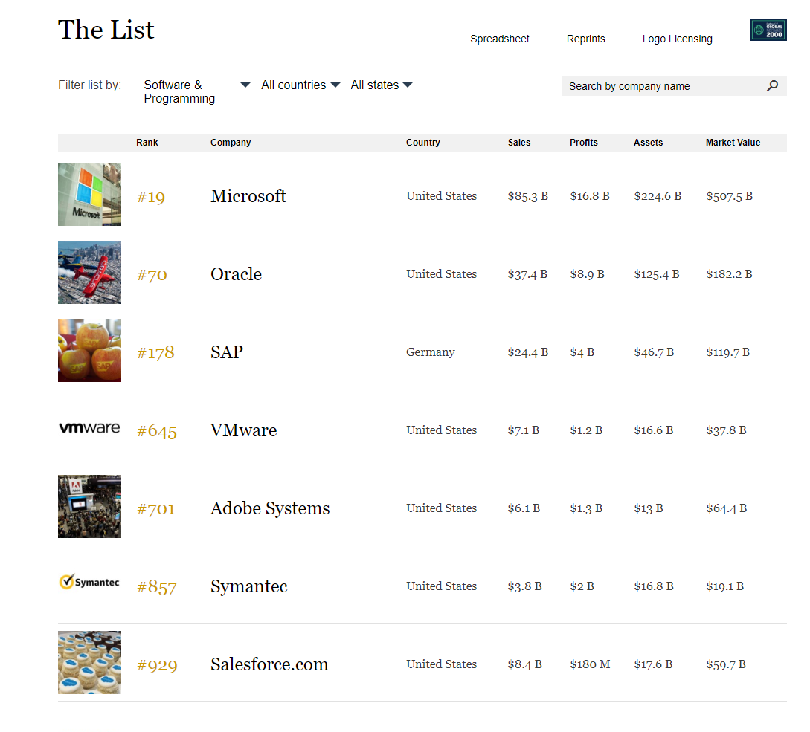
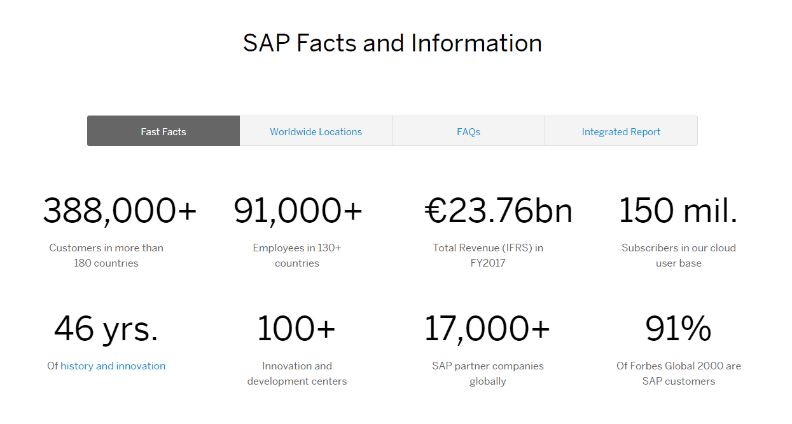
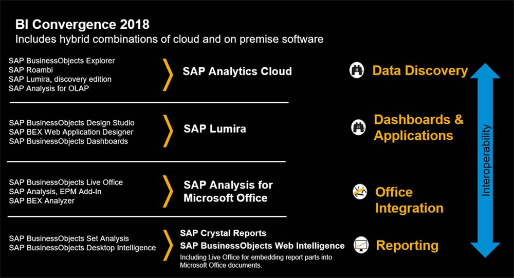
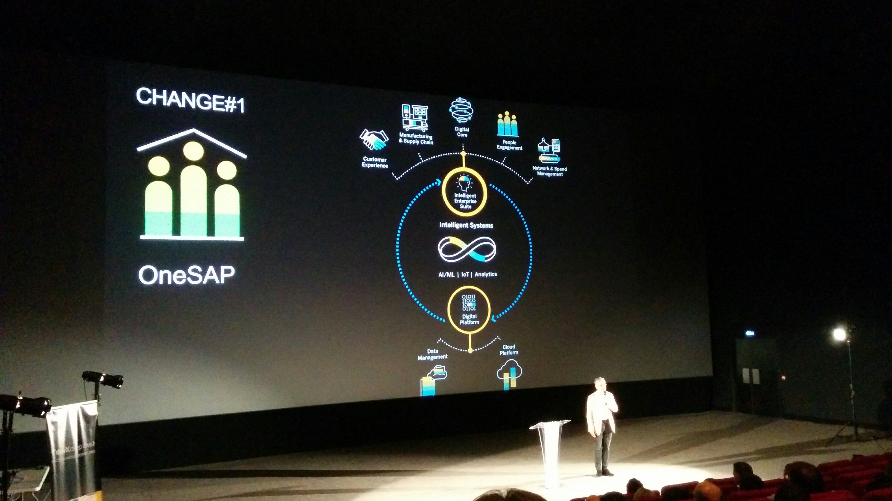
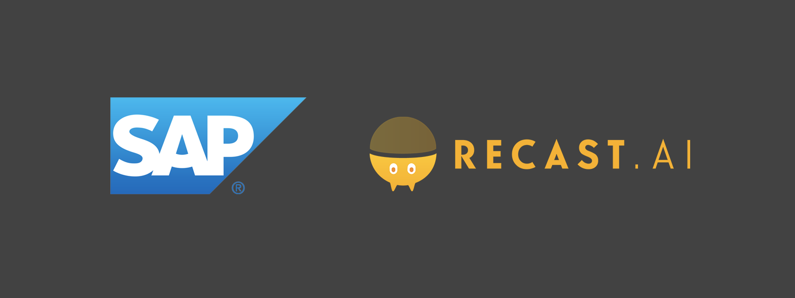
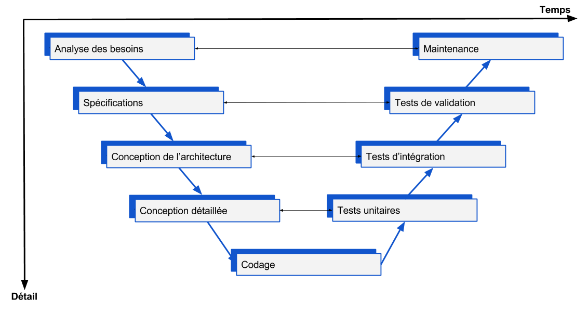
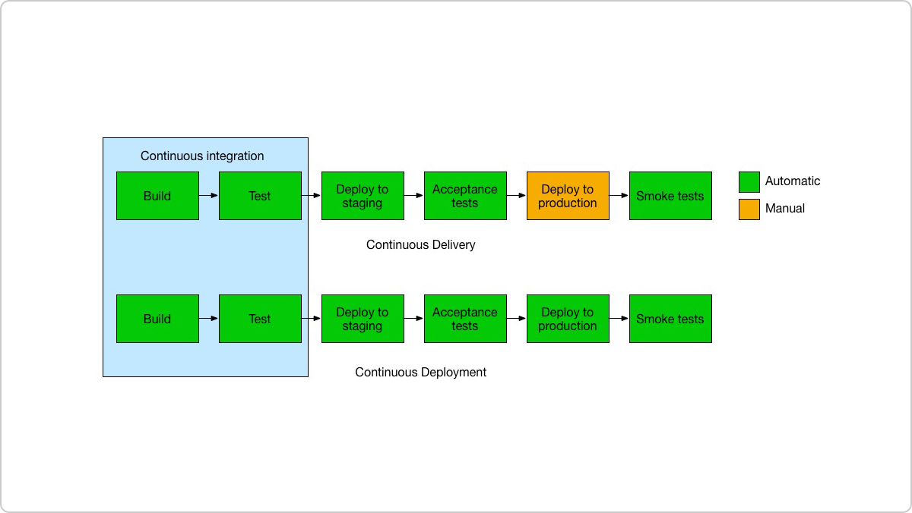

% Assistance à la mise en oeuvre d'une stratégie de tests automatisés
% Olivier CHECCHIN
% Stage du 30/04/18 au 15/06/18

# Introduction

Dans le cadre de stage obligatoire de fin d'année pour la formation délivrée par La Prépa des INPs, j'ai effectué un stage d'une durée d'un mois et demi dans l'entreprise SAP.

- [faire l'intro a la fin ]

# Cadre du stage

## Présentation de l'entreprise

### Généralités

SAP SE ou seulement SAP (SE signifiant "Societas Europaea" en latin) est une entreprise de droit européen dont le siège se trouve à Walldorf (Allemagne) qui conçoit et vend des logiciels. Ces logiciels sont principalement des outils permettant aux entreprises et aux institutions du monde entier de centraliser et analyser des données liées à leurs activités. SAP a été crée en 1972 par d'anciens employés d'IBM et s'appelait alors Systems Applications and Products in Data Processing.

Selon la liste Forbes de 2017 "The World's Biggest Public Companies", SAP est le premier producteur européen de logiciels et le troisième mondial derrière Microsoft (1) et Oracle (2). SAP est donc en concurrence directe avec Oracle et Microsoft, notamment sur son produit phare qui est le **progiciel de gestion intégrée**: SAP ERP. (voir Annexes/Divers)

Pour synthétiser, un logiciel ERP est un moyen d'intégrer les données de tous les départements d'une entreprise en un seul système accessible par tous, afin de faciliter les échanges d'informations. Il n'a donc pas de fonction d'analyse.

### Les Chiffres

Les produits SAP sont utilisés par de nombreuses entreprises dans le monde entier.
Anciennement, SAP était perçu comme un produit que seul les grandes entreprises avaient les moyens de s'offrir. Or aujourd'hui, la plupart des clients sont des PMEs (environ 80%), cela vient du fait que SAP a adapté son offre à différents publiques. \
Ce n'est pas pour autant que les grandes sociétés ne l'utilise plus. En effet, parmi les clients, on trouve par exemple 98% des marques possédant la valeur la plus élevée.
On peut constater que les revenus totaux IFRS de SAP, qui étaient de €23.76 milliards, sont en croissance (+9% au premier semestre de 2018). Et cela vient en grande partie de l'explosion de l'activité liée au Cloud (avec un taux de croissance de 31% pour la même période).

SAP possède aussi plus de 100 centres d'innovations et de développement. Ces centres sont principalement situés en Allemagne, en France, en Irlande et aux USA. \
Pour ce qui est de la France, le siège se situe au 35 rue d'Alsace dans la ville de Levallois-Perret. C'est donc dans cette tour de 20 étages que j'ai effectué mon stage. On peut trouver dans cette tour:

* des départements liés aux différents produits
* des départements liés aux ressources humaines, au service marketing
* un centre de formation
* ...

Cette organisation reflète une des philosophies phare de SAP qui est le **One SAP**.

### Les Produits

Les produits SAP sont totalement intégrés, ce qui signifie qu'ils agissent comme un seul produit, avec donc une seule base de donnée et proposent une mise à jour en temps réel des informations modifiées dans tous les modules affectés. Cela signifie aussi qu'il y a une totale traçabilité des opérations de gestion. Tous ces aspects permettent de mieux contrôler les aspects financiers, légaux et les ressources (manpower, machines, capacités de production).

On réduit souvent SAP au produit ERP et même à ce qu'on appelle "legacy ERP" ou l'ancien ERP. (voir Annexes/Divers)

SAP a aujourd'hui pour but de changer cette image et a pour stratégie d'investir majoritairement dans le **Cloud** et les nouvelles technologies et en particulier ce qui touche aux analyses prédictives à l'aide d'intelligence artificielle. \
Ainsi maintenant, SAP propose un large panel de produits dans plusieurs catégories:

* l'ERP (S/4HANA Cloud)
* Cloud et plateformes de données (Big Data, HANA)
* Achats et réseaux (fournisseurs et sources d'approvisionnement)
* Outils d'analyse (analyse prédictive, Business Intelligence BI)
* Client et commerce (marketing ...)
* IoT et chaîne logistique numérique (gestion d'objets connectés, gestion des stocks et fournisseur)
* Ressources humaines
* Gestion financière

On appelle planning l'utilisation d'outils permettant de présenter les objectifs opérationnels et financiers d'un business. On obtient alors un plan business qui comporte les détails du plan notamment au niveau financier, qui montre comment les objectifs doivent être réalisés.

La BI, aussi connue sous le nom d'informatique décisionnelle, représente l'ensemble des outils et méthodes permettant d'analyser puis de transmettre les informations pertinents aux managers d'entreprise (informations qui proviennent du système ERP) dans des formats adaptés: des dashboards (tableaux de bord) contenant différents graphiques, des rapports etc...

Il y a aussi l'autre outils d'analyse: la **Predictive Analytics**. Alors que la BI n'a qu'un rôle d'analyse descriptive, la Predictive Analytics consiste à trouver et quantifier des motifs cachés dans les données, ce qui permet après une analyse mathématique de construire des modèles qui permettront ensuite à partir de nouvelles données de prédire des résultats futurs.

SAP a pour objectif pour le deuxième semestre de 2018 de faire converger ces deux fonctions dans un seul produit, et ce dans le Cloud:

>"SAP Analytics Cloud will be SAP’s primary solution for data discovery moving forward. New data discovery investments will be focused on SAP Analytics Cloud, where you can discover, analyze, plan, predict, and collaborate in one seamless experience that integrates with both on-premise and cloud-based data sources and applications."

>"A Deeper Look Into SAP’s BI and Analytics Strategy", February 7, 2018 by Mike Flannagan

C'est donc sur ce produit qui réunit la BI, le planning et l'analytique, qui se veut hybride (supporte à la fois les produits on-premise et les produits Cloud) et facile d'intégration, que j'ai travaillé.
Ce produit à pour vocation d'être intégré dans la plateforme Cloud SAP: **SCP**.

### Philosophies et stratégies

#### Stratégies

SAP oriente très fortement sa stratégie vers les nouvelles technologies qui sont:

* le Cloud: l'ensemble des services que l'on peut fournir via Internet
* l'IA, le Machine Learning (ML) et le Big Data: la possibilité, grâce à des algorithmes qui apprennent via des données, pour une machine de faire des choses intelligentes (prédictions, communication ...)
* IoT: Internet of Things: la gestion de l'ensemble des objets connectés
* la blockchain: un moyen rapide, sécurisé, transparent et stable pour communiquer et faire des transactions

On pourrait en fait regrouper toutes ces technologies dans le Cloud. On reverra plus en détail cette notion de Cloud.

Les points forts de SAP sont la qualité de ses produits et le fait qu'ils soient toujours à la pointe des technologies, comme le montre un de leurs slogans:

> "SAP is the best partner to solve problems you haven't found yet"

#### Environnement

SAP consacre une place importante au développement durable et à l'écologie en général. \
Un premier exemple est celui du la Tour SAP. Cette tour possède plusieurs certifications garantissant un impact environemental limité. On peut compter comme initiatives la mise en place de bornes de tri pour les déchets, la mise à disposition de gourdes et mugs pour limiter la consommation de plastique ...

De manière plus générale, voici un autre slogan de SAP:

> "Help the world run better and improve people's lives."

En 2017, SAP a reçu plusieurs récompenses dans les classements des entreprises les plus propres (Dow Jones Sustainabilty Indices, Oekom ranking ...). \
On peut compter comme actions phare:

* leur infrastructure Cloud est alimentée à 100% par des énergies renouvelables
* SAP supporte les "17 United Nations Sustainable Development Goals"
* SAP promet de planter 5 millions d'arbres avant 2025
* SAP vise à avoir un parc véhicule 100% électriques pour réduire l'empreinte carbone

SAP offre aussi à ses employés des conditions de travail très accommodantes, avec notamment la possibilité de choisir ses horaires de travail, des distributeurs gratuits de boisson mis à disposition dans plusieurs endroits consacrés à la détente, la possibilité de faire du télétravail ...

SAP permet à ses employés d'organiser des Team Buildings pendant les heures de travail (il peut s'agir de pôts, de journées d'activités ...) afin de consolider l'esprit d'équipe et la communication. \
J'y ai moi-même participé, avec notamment des conversations à but constructifs où chacun est amené à partager sa vision d'un monde idéal, ses motivations, et donc des points à améliorer notamment au travail. \
On peut aussi remarquer la présence de coachs pouvant aider les employés à garder une hygiène de vie saine et à réaliser leurs objectifs.

#### One Team OneSAP

La stratégie de SAP est de présenter un front uni aux clients. Il est très important de faire savoir que l'entreprise à des stratégies claires et des buts précis, qui sont aussi partagés par les employés: innovation, qualité, confiance et sécurité, écologie ...

De plus il n'y a pas de distinctions entre les différents produits: les produits sont entièrement intégrés et leur conception ne se fait pas non plus séparément. Le meilleur exemple est la Tour SAP en France où tous les produits sont développés au même endroit, ainsi que le R&D avec SAP Labs, et chaque année des start-up sont intégrées dans ce projet.

J'ai eu l'occasion d'observer l'intégration dans SAP d'une start-up nommée Recast.ai notamment présentée lors d'une conférence ayant pour but de présenter aux employés des félicitations pour les résultats, des encouragements et les stratégies futures. Lors de cette conférence, on a aussi eu la chance d'écouter le nouveau (depuis le Vendredi 13 Avril 2018) DG français Gérald Karsenti qui a expliqué que la France allait être le futur centre d'innovations et recherches pour SAP.

Cela a été possible notamment grâce à une collaboration entre le CEO Bill McDermott et le président M.Macron et parce que le marché français est le plus dynamique aujourd'hui pour ce qui est du Cloud.

La start-up Recast vient ajouter aux technologies intelligentes de SAP ce qu'on appelle le "Natural Language Processing". C'est en fait l'ensemble des technologies qui permettent aux machines de pouvoir manipuler de manière intelligente le language humain. L'approche actuelle est mathématique et est de considérer les mots ou plutôt leur sémantique comme des vecteurs dans un espace de grande dimension, ainsi (grossièrement) on peut donner une intention à une phrase en additionnant les vecteurs. \
Le produit final proposé par Recast est un chatbot intelligent, qui m'a été présenté ainsi qu'à d'autres employés de SAP lors d'une session pratique "Hands-on".

#### #ChooseFrance

Comme dit précédemment, SAP à la volonté d'investir en France, car le Cloud est en plein essor et il y a une collaboration importante avec le président. \
SAP était aussi l'entreprise phare de l'évènement très connu Viva Tech (le 24 Mai à Paris ) qui réunit plein d'entreprises et start-ups liées aux nouvelles technologies.

## L'organisation
Nous allons voir que la migration vers le Cloud et que les besoins de rapidité et d'agilité étant toujours plus grands, cela à forcer plusieurs des grandes entreprises comme SAP et Google à adopter de nouvelles méthodes de travail. Mais qu'est ce que le Cloud exactement?

### Le Cloud Computing

On appelle Cloud Computing l'ensemble des services liés aux ordinateurs pouvant être délivrés à distance (souvent par le biais d'Internet). Ces services peuvent être de la puissance de calcul, du contenu web (sites), de l'espace de stockage ... \
On peut distinguer plusieurs types de services (ce nombre de type augmente avec les nouvelles technologies), qui sont nommés en anglais suivant le même principe: \
Initiale(s) du type de service + aaS signifiant "as a Service".

* SaaS ou Software as a Service: c'est la possibilité d'utiliser un logiciel non pas directement sur notre machine (On Premise) mais sur le Cloud via un site Internet.

* PaaS ou Platform aaS : cela fourni via un site Internet une plateforme de travail (framework), c'est à dire qu'il met à disposition des outils permettant de créer et déployer de nouveau services/applications sur Internet

* IaaS ou Infrastructure aaS: cela permet d'accéder à du "hardware" (serveurs, disque durs, processeurs ...) directement via Internet. Ces ressources sont accessible à la demande et ne demande aucune installation ou coût de maintenance au client.

### Les nouveaux besoins

Avec la migration vers le Cloud, on comprend bien que des nouveaux besoins sont apparus:

* le logiciel doit être disponible sans interruptions et pourtant doit être mis à jour régulièrement
* il faut pouvoir s'adapter rapidement au feedback des utilisateurs
* la notion de "scalability" ou mise à l'échelle est très importante: le nombre de clients ou la taille des données ne doit pas être un problème, cela passe par des processus automatiques

Tout particulièrement pour les projets informatiques (sans prendre en compte la dimension Cloud), les anciennes approches de gestion de projets sont inefficaces, coûteuses et prônes à l'échec. \
La plus répandue étant l'approche prédictive et séquentielle de type cycle en V ou "waterfall" (en cascade). Dans ces approches traditionnelles, le client exprime avec détail son besoin avec le cahier des charges, cette structure rigide laisse peu de place au changement.

On observe alors ce qu'on appelle l'effet tunnel: le client exprime son besoin, un plan rigide est determiné avec une deadline, les développeurs se lancent dans le tunnel où le client n'a aucune visibilité puis il ressortent au moment de la deadline.\
La deadline étant inamovible, il était très courant qu'à la fin, le produit soit délivré inabouti et en plus souvent en décalage par rapport au besoin initial qui a probablement changé en cours de route.

Par exemple, l'approche en V consiste à planifier de façon séquentielle, et finie dans le temps, les étapes du développement. Pour cela, il faut faire une analyse complète du besoin, ce qui peur prendre des semaines pour les gros projets. \
Ensuite les fonctionnalités sont implémentées une par une. Puis elles sont testées, intégrées et validées. Il y a donc peu de place pour intégrer des modifications et le fait de séparer le développement des tests amène à augmenter la difficulté donc le temps et le coût dédiés aux debugging.

Aujourd'hui les besoins des clients évoluent constamment, car souvent le besoin était mal exprimé et de plus ils veulent être à la pointe de la technologie et non pas attendre une année avant de se voir délivrer une nouvelle fonctionnalité.

### La philosophie Agile

Les compagnies informatiques ont alors lancer une réflexion sur les nouvelles approches à avoir. De ces réflexions sont ressorties ce qu'on appelle la philosophie Agile qui repose sur 4 valeurs et 12 principes. (voir Annexes/Divers)

Il faut retenir que le type de projet conseillé est incrémental (rapidement la première version puis on ajoute des fonctionnalités), la communication est primordiale notamment de vive-voix, une intégration et des tests continus, un échange avec le client afin de fournir le produit le plus adapté, l'embrassement des changements ... \
On retrouve beaucoup cette philosophie chez SAP: le système de réunions qui est intégré avec les mails, l'utilisation de Skype, les différentes réunions/présentations...

Pour ce qui est de Skype, il est utilisé constamment pour contacter des personnes des autres centres SAP (donc en Anglais), pour communiquer avec des personnes en télétravail ... \
Au niveau matériel, chaque développeur possède deux écrans, ce qui permet de faire des partages d'écran avec Skype tout en manipulant d'autres choses. Lors d'une réunion dans une salle réservée, les écrans et haut-parleurs sont directement connectés à un appel Skype crée automatiquement.

Pour finir, les open-spaces créent une proximité entre les personnes favorisant la communication et la bonne humeur. Il n'est pas rare que les personnes se déplacent directement pour parler avec quelqu'un de quelconques problèmes.

### Scrum: une méthode Agile

La mise en pratique la plus populaire de management de projet dans les équipes de développeurs est le Scrum. Il faut savoir qu'il y a des formations et donc des compétences demandées pour faire du Scrum. On distingue 3 rôles:

* le "Product Owner" (PO): il a une vision global du projet et du produit à réaliser, il est expert sur le sujet
* le "Scrum Master": il garantit la bonne application de la méthodologie Scrum, qui souvent est aussi un développeur
* le développeur qui transforme les besoins exprimés par le PO en fonctions utilisables

Le projet se déroule alors en une succession de sprint ou run c'est à dire des itérations pendant lesquelles des fonctionnalités sont ajoutées puis intégrées à la fin. Les itérations sont rythmées par des meetings bien définis et limitées dans le temps:

* la planification du sprint : les développeurs, en accord avec le PO, sélectionnent les éléments prioritaires à implémenter. Il faut à la fois terminer les ajouts précédents et choisir les éléments ayant le plus de valeur ajoutée. Ces éléments sont contenus dans le "Product Backlog" qui est une liste ordonné des fonctionnalités.
* les mêlées quotidiennes ou "stand up meeting" : les membres de l'équipe se réunissent pendant environ 15 minutes. Chacun explique ce qu'il a fait hier, ce qu'ils font et s'ils rencontrent des problèmes.
* la revue de sprint (fin): les développeurs présentent les fonctionnalités terminées et reçoivent les feedbacks du PO et des clients. On peut aussi anticiper les prochains sprints.
* la rétrospective de sprint (après la revue): en regard du sprint qui vient de passer, on étudie les points qui permettraient d'améliorer la productivité, la qualité, les conditions de travail ...

Les sprints durent souvent de 2 à 4 semaines (2 chez SAP). Ils s'enchainent jusqu'à la fin de la conception du produit (décision du PO). Le Product Backlog peut être changé entre chaque sprint par le PO, mais lors d'un sprint, seul les développeurs décident des priorités.

Dans une des mes équipes, on utilise aussi la méthode kanban lors des mêlées quotidiennes. Ce système visuel permet de connaître l'avancement des tâches de tout le monde. On utilisait pour notre part des post-it avec le nom de la personne et la tâche associée sur un mur vitré, comme le montre ces photos.

Ainsi lors des meetings, les tâches sont déplacées vers les colonnes de droites, avec des explications.

### DevOps: une extension Agile

L'approche DevOps est en quelque sorte l'extension de la philosophie Agile en dehors du cadre d'une équipe de développeurs.

Comme le nom l'indique, le principe de cette approche est de mélanger les rôles de Dev(eloppeur) et Op(ération)s. Traditionnellement, le développement de logiciels se faisait dans un cadre dit de silo: les devs ne faisait que programmer, souvent sur leurs propres machines, des parties du logiciel. Les Ops eux étaient chargés de la production et de la stabilité du logiciel: cela passe par l'intégration du code fournie par les devs, par la mise en place de l'architecture réseau (serveurs)... puis par la production en elle-même.

Cela posait de multiples problèmes qui résultaient souvent en des délais et des coûts de production plus élevés que prévus. \
On compte dans ces problèmes le fait que
* les deux équipes rejetaient toujours la faute sur l'autre
* chaque développeurs ayant son propre environnement (OS, versions de logiciels comme Java ...) ce qui peut créer des problèmes de compatibilité
* les divergence d'objectifs: quantité et rapidité pour les devs, qualité pour les ops
* les devs ne savent pas ce que font les ops et ne peuvent donc pas mettre en place des bonnes pratiques (pour les futurs tests et/ou futurs déploiement)
* inversement les ops ne comprenent pas les problèmes auquels sont confrontés les devs

La pratique DevOps consiste donc à ce que les équipes ops et devs travaillent mains dans les mains sur la production de logiciel, de la conception à la production en passant par des étapes de tests. Cela repose beaucoup sur l'automatisation des procédures que ce soit de tests ou d'intégration de code dans le logiciel. \
On verra quels outils permettent la mise en place de cette pratique.

Cette pratique prend une autre dimension avec le Cloud: idéalement, il serait possible à chaque ajout des développeurs de l'intégré directement dans l'application utilisée par les clients. \
On parle de "Continous Deployment" ou déploiement en continu.
Ce n'est pas encore tout à fait le cas pour le produit SAC. (voir Annexes/Divers/Livraison et déploiement de l'application)

# Mission, outils et résultats

## Ma mission

### Remise en contexte

Pour reprendre ce que j'ai précédemment avancé: j'ai travaillé au 10 ème étage de la tour SAP Levallois, spécifiquement sur le produit SAC (SAP Analytics Cloud). Ce logiciel est développé exclusivement sur le Cloud, et est du type SaaS (Software as a Service). Grâce à de multiples fonctionnalités, il permet à une entreprise de pouvoir faire de la BI, du planning (ERP) et du prédictif.

### Mes équipes

Lors de ce stage, j'appartenais à deux équipes:

* une équipe de développeurs responsable d'un module particulier du logiciel
* l'équipe transversale responsable du support du logiciel SAC

#### L'équipe développeur

Les deux équipes étaient situées dans deux open spaces différents, j'étais pour ma part dans celui de l'équipe de développeurs. Cette équipe travaille donc sur la partie du logiciel nommée "Ppro-core" ou "Predictive pro core", c'est à dire le coeur de la partie prédictive du logiciel.
On peut généralement séparer un logiciel en deux partie: le **Front-end** et le **Back-end**.

Le Front-end correspond à la partie visible par l'utilisateur, ce qui correspond à l'UI et l'UX:

* l'UI ou User Interface: c'est l'interface utilisateur, le but étant d'avoir un logiciel graphiquement attractif
* l'UX ou User eXperience: c'est l'expérience utilisateur, le but étant de fournir un logiciel agréable et facile d'utilisation

Le Back-end correspond à la partie "cachée" du logiciel: c'est celle qui implémente les fonctionnalités proposées à l'utilisateur via le Front-end.

Mon équipe de développeur quant à elle a un rôle plutôt Back-end, bien que l'algorithme le plus fondamental est implémenté par une autre équipe. Cet algorithme est le noyau prédictif, qui est en cours de développement et qui permet de grâce à l'IA et au ML de faire des analyses prédictives sur la base de donnée HANA. \
Cet algorithme provient d'une ancienne start-up rachetée par SAP: Kxen. Une bonne partie des personnes travaillant aujourd'hui autour de ce produit faisaient alors partie de Kxen.

Ainsi le rôle de cette équipe et d'implémenter les échanges avec le noyau prédictif, HANA, et la UI sur toutes la parties du logiciel SAC concernant la manipulation de modèle prédictif. Pour rappel, un modèle prédictif permet à partir d'un set de données de prévoir l'évolution d'une autre donnée, qui peut être par exemple si oui ou non un prospect va probablement acheter un produit SAP.

#### L'équipe transversale

Mon équipe initiale est celle responsable de support du développement de SAC. C'est donc une équipe transversale qui communique avec toutes les équipes s'occupant du développement de ce produit, que ce soit des équipes de développeurs ou des "Product Managers" (voir Annexes/Product Managers).

Dans les rôles de support, on compte:

* l'infrastructure
* le déploiement
* la qualité

L'infrastructure correspond à l'ensemble des ressources matérielles (puissance de calcul) et des outils fournis aux développeurs pour leur permettre de programmer dans les meilleurs conditions et dans des environnements uniformisés. \
On peut citer comme métier associé celui d'Infrastructure Owner responsable de la gestion/l'allocation de ces ressources. (voir Annexes/Divers et Outils)

Le déploiement correspond à l'ensemble des procédures et outils utilisés pour optimiser (au niveau du temps, du traitement) les processus allant de la programmation à la publication dans le logiciel.
On peut citer comme métier associé celui de DevOps Manager responsable d'inculquer aux équipes les bonnes pratiques de l'approche DevOps.

Vient ensuite la qualité, c'est sur cette partie que mon stage portait. \
La qualité est l'ensemble des procédures permettant de vérifier le bon fonctionnement et la pertinence (par rapport au client) du logiciel.
On peut citer comme métier associé celui de QA Lead ou responsable qualité.

Dans ces trois rôles, il est important de remarquer qu'une grande partie du travail tend à rendre les processus automatiques. Et ce pour des questions de rapidité et donc de coût, et de mise à l'échelle.

### La Qualité

Une grosse partie du travail sur la qualité se fait à travers les tests.

Il existe plusieurs type de test, qui doivent être exécutés dans un certain ordre:

1. les tests unitaires ou "Unit tests"
2. les tests d'intégration ou "Integration tests"
3. les tests fonctionnels
4. les tests de performances

Les premiers acteurs de ces tests sont les développeurs. Ils s'occupent de faire les tests unitaires et d'intégration.

Les tests unitaires sont écris par les développeurs afin de tester une unité de programme (grossièrement une petite partie de code) ou module. \
Pour tester ces modules, le reste du logiciel simulé à l'aide de ce qu'on appelle un "mock", c'est à dire qu'on imite l'extérieur en fournissant des données factices à cette partie du code afin de retrouver ou non les résultats attendus en sortie. Ces tests ne doivent en aucun cas dépendre de composants extérieurs comme des librairies.

Les tests d'intégrations quant à eux vise à s'assurer que tout fonctionne lorsque l'on assemble plusieurs modules déjà testés unitairement.

A un niveau plus élevé vient ensuite les ingénieurs qualités. Ils réalisent pour leur part les tests fonctionnels et ceux de performances. \
Il est et il sera toujours nécessaire de faire ces test manuellement. Cependant ces tests ont aussi intérêt a être exécutés de manière automatique: par exemple les tests doivent être faits sur différentes plateformes, différents navigateurs web...

Un test fonctionnel est en fait un test d'intégration "end-to-end" ou de bout-en-bout c'est à dire sur l'intégralité des fonctionnalités (ou suivant un certain scénario) du logiciel. \
Les tests de performances servent à s'assurer que le logiciel est assez robuste pour des nombres importants d'utilisateurs, de demandes ou d'échanges de données.

Chez SAP, des sessions de tests fonctionnels non guidés sont organisés toutes les deux semaines. On appelle ces sessions "Testa Fiesta" et des personnes de toutes les équipes (pas seulement qualité) y participent.\
A la fin, les bugs rencontrés sont rapportés aux QA Leads.

Une autre partie importante de la qualité est de s'assurer de la pertinence du produit. \
Pour ce faire, et dans la continuité de la méthode Agile, SAP propose un système de Bêta test. Cela fonctionne de la manière suivante: \
Des clients se portent volontaire pour utiliser le logiciel qui est en cours de développement. Lors de cette utilisation, ils testent les fonctionnalités sur des cas réels pour vérifier la fiabilité, pour s'assurer qu'il correspond à leurs besoin etc... A la suite de ces tests, ils doivent communiquer les résultats à SAP. Lors de cette communication, ils rapportent les différents bug rencontrés et ils exposent un avis sur les fonctionnalités (déjà présentes ou non).

Ainsi SAP sera capable de corriger les bugs, et plus important encore, SAP pourra décider de mettre en place les fonctionnalités qui présentent le plus de valeur ajoutée pour les clients et/ou modifier la manière dont les fonctionnalités existantes sont implémentées. \
Comme expliqué précédemment, ce sera le rôle du PO (Product Owner) de décider quels modules sont à ajouter et dans quel sprint. \
On appelle cette méthode la co-innovation.

### Objectif

Voici le sujet de stage qui m'a été donné lors de la rédaction de la convention:

>"Assistance à la définition et mise en œuvre d’une stratégie de tests automatisés permettant de
valider les développements effectués par l’organisation Advanced Analytics pour la livraison de la
solution prédictive de SAP"

On retrouve donc les notions de tests automatisés, d'analytique et de prédictif vues précédemment. \
Qu'en est-il de la notion de stratégie de tests?

On appelle stratégie de test un ensemble de lignes directives qui expliquent comment les tests doivent être faits et donc quelles sont les pratiques qui doivent être mises en place pour permettre le test des développements.

Une stratégie de tests comprend le format de la documentation, les outils de tests utilisés, les outils et le format pour les résultats des tests ...

Ma mission était donc d'implémenter des tests fonctionnels automatisés, pour le logiciel SAC et plus particulièrement sur la partie concernant mon équipe de développeurs.

### Déroulement

Les deux premières semaines ont été consacrées à se familiariser avec le logiciel SAC: ce qu'il fait, comment il fait, dans quel but etc... \
Pour ce faire et pour contribuer au projet directement, j'ai commencé par faire des tests manuels d'intégration directement sur le logiciel. Je suivais en fait un scenario qui utilisait une grande partie des fonctionnalités disponibles de SAC. \
Ce scénario était stocké sur un wiki interne SAP, mais il n'était pas totalement à jour à causes des modifications apportés continuellement, autant du côté UI que du côté fonctionnalités. Ma mission était donc en parallèle de mettre à jour ce scénario appelé "BAT Scénario".

Pendant ce temps, je me familiarisais aussi avec mon environnement, mes équipiers, le vocabulaire interne, l'organisation, et en grande partie aussi les outils utilisés. \
Dans ce but, j'ai participé directement à des réunions et des interviews/présentations individuels avec plusieurs membres des équipes, des repas le midi... J'ai fait beaucoup de recherches de mon côté pour me mettre à jour et pouvoir comprendre plus facilement tout ça.

Ensuite quand je suis arrivé à un bon stade de compréhension global, j'ai pu commencer à pouvoir essayer de faire des tests d'intégrations automatisés, donc qui demandent des compétences en programmation et dans les outils/frameworks utilisés. \
Ainsi j'ai refait une phase de découverte/assimilation qui a duré environ une semaine ou deux. Cette phase est particulièrement longue car il faut comprendre tout le travail qui a été fait précédemment. Ce travail représente un grand nombre de fonctions et de classes (on y reviendra) qui ont été mis en place justement pour pouvoir tester le logiciel. Pendant cette période j'ai aussi mis en place mon environnement de développement.

Finalement, j'ai pu commencé à coder ces tests automatiques. Et notamment j'ai codé un test automatique pour le scénario BAT. Au delà du test automatique, j'ai pu apporter des modifications aux frameworks de test, ce qui demande des compétences et une compréhension plus poussée.

## Les Outils

# code
~~~~
pandoc "rapport de stage.md" -o rapport.pdf -V fontsize=12pt -V linestretch=1 -V linkcolor=black --number-sections --table-of-contents -V documentclass=scrreprt
~~~~

# Annexes

## Divers

### ERP

Le terme **progiciel** est un mot-valise qui contracte "produit", "professionnel" et "logiciel". Il désigne une suite de logiciels applicatifs (qui sont directement utilisés pour accomplir une tâche), possédant de multiples fonctions et destinée à être utilisée par une large clientèle.

Un progiciel de gestion intégré **PGI**, ou son acronyme anglophone **ERP** (Enterprise Resource Planning), forme un **système d'information** (SI) pour une entreprise. Un SI est un ensemble organisé de ressources qui permet de collecter, stocker, traiter et distribuer de l'information. \
Pour un ERP, ce SI comporte un ensemble de modules fonctionnels, couvrant typiquement les achats, les stocks, la production, les ventes, la distribution, ainsi que les salaires, la comptabilité, les finances et la trésorerie. Tous les modules proviennent donc du même fournisseur (ici SAP) et travaillent sur une base de données unique (ici **HANA**, sur laquelle on reviendra plus tard).

On appelle legacy ERP une suite logicielle "On-Premise" qui a divergée du produit original du fait de customisations (développements spécifiques) importantes faites par l'entreprise. C'est donc une suite que le vendeur ne supporte plus, qui coute cher à l'entreprise et qui est difficilement mis à jour. **On-Premise** signifie "sur site", cela veut donc dire que l'entreprise devait installer et mettre en place la suite SAP et ses bases de données sur ses propres serveurs. La maintenance devait alors être assurée par l'entreprise.

### Le Manisfeste Agile

Les 4 valeurs:

>"Nous découvrons de meilleures approches pour faire du développement logiciel, en en faisant nous-même et en aidant les autres à en faire. Grâce à ce travail nous en sommes arrivés à préférer et favoriser"

* Les individus et leurs interactions plus que les processus et les outils.
* Un logiciel qui fonctionne plus qu’une documentation exhaustive.
* La collaboration avec les clients plus que la négociation contractuelle.
* L’adaptation au changement plus que le suivi d’un plan.

>"Cela signifie que bien qu'il y ait de la valeur dans les éléments situés à droite, notre préférence se porte sur les éléments qui se trouvent sur la gauche.""

Les 12 principes:

* Accueillez positivement les changements de besoins, même tard dans le projet.
* Livrez fréquemment un logiciel opérationnel avec des cycles de quelques semaines à quelques mois et une préférence pour les plus courts.
* Les utilisateurs ou leurs représentants et les développeurs doivent travailler ensemble quotidiennement tout au long du projet.
* Réalisez les projets avec des personnes motivées. Fournissez-leur l’environnement et le soutien dont elles ont besoin et faites-leur confiance pour atteindre les objectifs fixés.
* Privilégiez la co-location de toutes les personnes travaillant ensemble et le dialogue en face à face comme méthode de communication.
* Un logiciel opérationnel est la principale mesure de progression d'un projet.
* Les processus agiles encouragent un rythme de développement soutenable. Ensemble, les commanditaires, les développeurs et les utilisateurs devraient être capables de maintenir indéfiniment un rythme constant.
* Une attention continue à l'excellence technique et à un bon design.
* La simplicité – c’est-à-dire l’art de minimiser la quantité de travail inutile – est essentielle.
* Les meilleures architectures, spécifications et conceptions émergent d'équipes auto-organisées.
* À intervalles réguliers, l'équipe réfléchit aux moyens possibles pour devenir plus efficace. Puis elle s'adapte et modifie son mode de fonctionnement en conséquence.

### L'infrastructure

On appelle infrastructure tout ce dont les développeurs ont besoin pour travailler. Cela prend en compte les équipements informatiques matériels ou réseaux, ainsi que l'environnement de développement utilisés par les développeurs. \
Par environnement de développement on entend l'ensemble des logiciels, librairies, outils utilisés pour développer.

La partie infrastructure est très importante. Les développeurs doivent pouvoir accéder à des machines (et donc mémoire vive, processeurs) autres que celle sur laquelle ils codent. En fait, des qu'ils font autre chose que du codage, les développeurs font appel à des machines virtuelles qui font des opérations à leur place.

De plus, tout le monde doit pouvoir utiliser le même environnement et pouvoir le mettre en place assez rapidement, aussi de manière automatique (on verra cela plus en détail dans la partie **Outils**).

### Livraison et déploiement de l'application

Comme expliqué précédemment, le logiciel SAC est développé en continu tout en proposant des versions utilisables (stables) aux clients. \
La pratique DevOps étant encore en cours d'implémentation pour le département SAC, les modifications du logiciel ne sont pas instantanées et prennent en fait 6 semaines avant d'être délivrées.

#### Life Cycle Management (LCM)

Le logiciel est délivré sous forme de wave (par vague).

Tout d'abord, les différentes équipes travaillant sur SAC possèdent une version du logiciel qui leur est propre et où ils implémentent leurs modifications: l'espace **DEV** qui est donc très instable.

Ensuite, deux fois par jours, toutes les modifications sont mélangés dans un espace commun appelé **MASTER**, qui est alors plus stable que DEV.

Les développeurs travaillent sur Dev donc sur Master toute la durée d'un run (2 semaines).

A chaque fin de run, l'espace MASTER est déployé dans l'espace **STABI**. Cet espace est censé être sans bugs mais il est encore tester pendant deux semaines.

En fin à chaque fin de sprint, l'espace STABI est déployé dans l'espace **REL**(ease) qui est en fait le produit (pour l'instant en bêta) proposé aux clients.

#### Intégration en continue

Pour cette sous-partie, il est nécessaire d'avoir pris connaissance des Outils Git et Jenkins et Monsoon.

Le principe est de pouvoir intégrer chaque commit proposé avec git directement dans la branche principale. Pour accepter cela il faut d'abord que ces commits passent une série de tests qui confirment qu'ils ne fassent pas dysfonctionner l'application.

Assez naturellement, on va utiliser Jenkins pour créer un job qui se déclenche à chaque fois qu'un développeur propose un commit.

La première étape est de **build** le commit avec le reste du logiciel (qui est normalement stable), c'est à dire que l'on construit une nouvelle version du logiciel comprenant les changements apportés.

Ensuite le build (on associe l'objet créer après l'étape build au nom de l'étape) passe une série de tests automatiques (donc d'intégration, de performances, des tests fonctionnels, des tests liés à des restrictions légales ...).

Si tout les tests sont des succès, le commit reçoit un "+1", est validé et est intégré dans la branche principale Git. \
Chez SAP, on rajoute une sécurité: il faut que quelqu'un vérifie le code (il fait un "code review") et donne son "+1". \
Ainsi seul un "+2" permet à un commit d'être intégré.

#### Livraison en continue

La livraison en continue est en fait le prolongement de l'intégration: une fois le commit intégré, il est automatiquement livré c'est à dire qu'il est prêt à être déployé dans l'application.

#### Micro-services et déploiement en continu

Pour cette sous-partie, il est nécessaire d'avoir pris connaissance des Outils Cloud Foundry.

En principe le déploiement en continu revient a déployer directement chaque commit dans l'application finale. Il faut pour cela que des mesures soient prisent dès le développement du code.

Chez SAP le déploiement en continu ne s'applique que pour l'espace Dev. En effet, dès qu'un commit est intégré, il est livré puis déployé automatiquement dans Dev. \
Par contre, comme expliqué dans le LCM, Dev n'est pas l'application finale.

La stratégie à appliquer pour permettre le déploiement en continu est de concevoir le logiciel par composants, et non comme un tout (l'approche dite monolithique).

Chaque composants doit-être indépendant de tout le reste et possède ses propres ressources (database, UI ...). Un tel composant est en fait un micro-services. D'autres services appelés "Back-end" services sont assez similaires dans le fonctionnement mais sont moins contraignant.

Les applications développés avec des micro-services sont les plus adaptées pour le développement Cloud. En effet, à l'aide de plateformes PaaS comme Cloud Foundry, il est facile et performant de connecter un ensemble de micro-services.

Cela permet alors de faire des mises à jour sans "downtime" (sans que l'application soient inutilisable), de déployer des applications avec très peu de risque d'être "down", de multiplier ou réduire le nombre d'applications disponibles suivant les besoins...

### HANA

## Sources
[Progiciel](https://fr.wikipedia.org/wiki/Progiciel)

[PGI](https://fr.wikipedia.org/wiki/Progiciel_de_gestion_int%C3%A9gr%C3%A9)

[SAP Corporate Fact Sheet](https://www.sap.com/corporate/en/docs/download/2017/04/4666ecdd-b67c-0010-82c7-eda71af511fa.pdf)

[SAP Overview](https://searchsap.techtarget.com/definition/SAP)

[SAP products](https://www.sap.com/france/products.html)

[Comparative of ERP leaders](Clash-of-the-Titans-2017.pdf)

[Legacy ERP System](https://ercerp.wordpress.com/why-your-legacy-erp-system-needs-replacement/)

[From legacy ERP to S4/HANA](https://www.sap.com/france/products/erp/s4hana-erp.html#pdf-asset=6eec688c-927c-0010-82c7-eda71af511fa&page=2)

[SAP vs Oracle](https://www.quora.com/Why-is-SAP-generally-selected-over-Oracle-in-ERP)

[BI Convergence strategy](https://news.sap.com/deeper-look-sap-strategy-bi-analytics/)

[UN Sustainable Development](https://www.un.org/sustainabledevelopment/)

[UI vs UX](http://blog.lunaweb.fr/ux-ui-experience-utilisateur-interface/)

[What is DevOps](https://theagileadmin.com/what-is-devops/)

[Recast.ai et l'investissement de SAP en France](https://news.sap.com/sap-powers-innovation-france-acquires-recastai/)

[Cloud Computing Types](https://www.bmc.com/blogs/saas-vs-paas-vs-iaas-whats-the-difference-and-how-to-choose/)

[devops](https://theagileadmin.com/what-is-devops/)

[Le manifeste Agile et ses principes](https://fr.wikipedia.org/wiki/Manifeste_agile)

[Philosophie Agile et méthode Scrum](https://www.agiliste.fr/introduction-methodes-agiles/)

[Les différents types de tests](http://www.test-recette.fr/)

[Integration vs Delivery vs Deployment](https://www.atlassian.com/continuous-delivery/ci-vs-ci-vs-cd)
