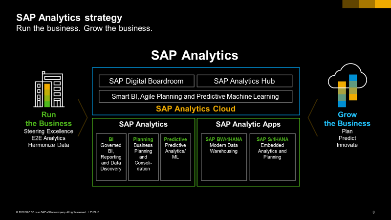

% Rapport de stage: Assistance à la mise en oeuvre d'une stratégie de tests automatisés
% Olivier CHECCHIN
% Stage chez SAP, du 30/04/18 au 15/06/18
---
header-includes:
  - \hypersetup{colorlinks=false,
            allbordercolors={0 0 0},
            pdfborderstyle={/S/U/W 1}}
---

# Introduction

## Avant-propos

Ce rapport de stage n'a pas été rédigé de manière optimisée pour être publié en format PDF. \
En effet, il a été écrit en Markdown: le langage optimisé pour être utilisé par Github dont on parlera plus tard. Le but étant de montrer un exemple pratique d'utilisation d'un outil informatique très populaire.

J'ai donc stocké mon rapport de stage et les fichiers associés dans un dépôt Github pour pouvoir travailler dessus.

Néanmoins, pour des raisons de confidentialité, il n'est pas possible d'accéder à ce dépôt qui est pour l'instant privé. Il sera disponible à partir du 16 Juin en suivant ce [lien](https://github.com/OlKakine/Rapport-de-stage).

La lecture sera alors beaucoup plus agréable, mais le contenu sera le même que sous le format PDF. \
De plus les images et la mauvaise conversion vers le format PDF sont responsables de la longueur (plus de 20 pages) du rapport. 

## Informations complémentaires

Dans le cadre de stage obligatoire de fin d'année pour la formation délivrée par La Prépa des INP, j'ai effectué un stage d'une durée d'un mois et demi dans l'entreprise SAP.

Mon tuteur enseignant est Mme.ESCOLIN qui enseigne la Culture Générale à La Prépa.

Mon maître de stage est Mme.ELGHARIB qui travaille chez SAP en tant que QA Lead.

{ height=100px}

## Résumé

Pendant mon stage, j'ai travaillé sur une partie d'un logiciel SAP en cours de développement dans le **Cloud**. \
Cependant, je n'ai pas participé directement au développement de ce logiciel mais j'ai aidé à le faciliter grâce à une activité de support: les **tests automatiques**.

Dans le cadre de nouvelles méthodes et philosophies de travail, ces tests ainsi que d'autres tâches automatiques deviennent primordiales dans la conception des logiciels.

Un concept à retenir est celui de **déploiement en continu**, qui est le but à atteindre pour la production de logiciels Cloud.

Afin de réaliser ma mission, j'ai du faire un travail important de recherche et de compréhension que ce soit sur les nouveaux outils ou les nouvelles méthodes de travail.

Au final, j'ai réussi à coder le test automatique qui était en fait ma mission. Pour ce faire, j'ai dû aussi contribuer à l'**environnement de travail** permmettant de coder les tests automatiques.

En parallèle, je me suis intéressé aux algorithmes prédicitifs utilisés par le logiciel, qui fonctionnent sur la base du **Machine Learning**. J'ai pu constater qu'une partie des connaissances (liées à l'optimisation) que j'ai acquises en Mathématiques et dans le thême Informatique sont très utilisées dans ce domaine.

Pour conclure, je dirais que cette première expérience de travail collaboratif de grande ampleur m'a permis de découvrir beaucoups de choses (notamment plein de métiers différents) qui me serviront sûrement dans le futur. De plus ce stage qui s'est déroulé dans de très bonnes conditions a confirmé mon envie de me spécialiser dans l'informatique.

## Remerciements

J'ai reçu un accueil, chez SAP et dans mes équipes, des plus chalereux, en contraste avec un environnement parisien plutôt hostile.

C'est pourquoi je tenais à adresser mes remerciements les plus sincères à plusieurs personnes.

Je pense en premier lieu à mon manager David qui m'a fait confiance, qui m'a intégré dans l'équipe et qui m'a supporté dès le premier jour. Merci encore pour toute cette motivation et ces attentions que tu m'as porté.

Vient ensuite Sophie, mon maître de stage, qui m'a consacré beaucoup de temps et de ressources (notamment ce beau poste de travail). J'ai pu évoluer rapidement dans mon travail grâce à toi et tes nombreux conseils. Je retiens particulièrement les repas partagés, la bonne humeur et les blagues (ainsi que mes victoires sur Duel Quizz).

Avec Sopie est venu la rencontre avec Dominik, l'autre stagiaire, avec qui j'ai passé beaucoup de temps. On s'est rapproché rapidement du fait de la proximité d'âge notamment. On a vécu beaucoup de moments marquants, commme la défaite cuisante au babyfoot, le café-vanille, la victoire à la pétanque, la soirée Spring Break... \
Merci pour tous ces moments d'échanges et de convivialité!

Je tenais à remercier toutes mes équipiers qui m'ont accueilli sans me mettre à distance, et qui au contraire se sont intéressés à moi et m'ont intégrés directement dans l'équipe. Votre cohésion et complicité m'ont permis d'être à l'aise dans une très bonne ambiance de travail. \
Plus particulièrement je voulais remercier Christian, Dominique, Rovland, Magali, Guillaume, Minh, David et Jacques pour m'avoir fournis des aides précieurses voire des formations qui ont permis une bien meilleure compréhension des outils et des métiers.

Pour finir, je remercie la direction de SAP ainsi que le personnel (à l'accueil, les cuisiniers, les techniciens de surface ...) pour m'avoir permis de faire mon stage dans un environnement de vie et de travail plus qu'agréable.

# Cadre du stage

## Présentation de l'entreprise

### Généralités

SAP SE ou seulement SAP (SE signifiant "Societas Europaea" en latin) est une entreprise de droit européen dont le siège se trouve à Walldorf (Allemagne) qui conçoit et vend des logiciels. Ces logiciels sont principalement des outils permettant aux entreprises et aux institutions du monde entier de centraliser et analyser des données liées à leurs activités. SAP a été créée en 1972 par d'anciens employés d'IBM et s'appelait alors Systems Applications and Products in Data Processing.

Selon la liste Forbes de 2017 "The World's Biggest Public Companies", SAP est le premier producteur européen de logiciels et le troisième mondial derrière Microsoft (1) et Oracle (2). SAP est donc en concurrence directe avec Oracle et Microsoft, notamment sur son produit phare qui est le **progiciel de gestion intégrée**: SAP [ERP](#erp).

{ height=200px }

Pour synthétiser, un logiciel ERP est un moyen d'intégrer les données de tous les départements d'une entreprise en un seul système accessible par tous, afin de faciliter les échanges d'informations. Il n'a donc pas de fonction d'analyse.

### Les Chiffres

Les produits SAP sont utilisés par de nombreuses entreprises dans le monde entier.
Anciennement, SAP était perçu comme un produit que seul les grandes entreprises avaient les moyens de s'offrir. Or aujourd'hui, la plupart des clients sont des PMEs (environ 80%), cela vient du fait que SAP a adapté son offre à différents publics. \
Ce n'est pas pour autant que les grandes sociétés ne l'utilisent plus. En effet, parmi les clients, on trouve par exemple 98% des marques possédant la valeur la plus élevée.
On peut constater que les revenus totaux IFRS de SAP, qui étaient de €23.76 milliards, sont en croissance (+9% au premier semestre de 2018). Et cela vient en grande partie de l'explosion de l'activité liée au Cloud (avec un taux de croissance de 31% pour la même période).

SAP possède aussi plus de 100 centres d'innovations et de développement. Ces centres sont principalement situés en Allemagne, en France, en Irlande et aux USA. \
Pour ce qui est de la France, le siège se situe au 35 rue d'Alsace dans la ville de Levallois-Perret. C'est donc dans cette tour de 20 étages que j'ai effectué mon stage. On peut trouver dans cette tour:

* des départements liés aux différents produits
* des départements liés aux ressources humaines, au service marketing
* un centre de formation
* ...

Cette organisation reflète un philosophie phare de SAP qui est le **One SAP**.

On peut ajouter que SAP possède la plus grosse part de marché (19%) devant Microsoft (17%) et Oracle (13%) sur le marché de l'ERP.

### Les Produits

Les produits SAP sont totalement intégrés, ce qui signifie qu'ils agissent comme un seul produit, avec donc une seule base de données et proposent une mise à jour en temps réel des informations modifiées dans tous les modules affectés. Cela signifie aussi qu'il y a une totale traçabilité des opérations de gestion. Tous ces aspects permettent de mieux contrôler les aspects financiers, légaux et les ressources (manpower, machines, capacités de production).

On réduit souvent SAP au produit ERP et même à ce qu'on appelle "legacy ERP" ou l'[ancien ERP](#erp).

SAP a aujourd'hui pour but de changer cette image et a pour stratégie d'investir majoritairement dans le **Cloud** et les nouvelles technologies, en particulier ce qui touche aux analyses prédictives à l'aide de **Machine Learning**. \
Ainsi maintenant, SAP propose un large panel de produits dans plusieurs catégories:

* l'ERP (S/4HANA Cloud)
* Cloud et plateformes de données (Big Data, HANA)
* Achats et réseaux (fournisseurs et sources d'approvisionnement)
* Outils d'analyse (analyse prédictive, *Business Intelligence* BI)
* Client et commerce (marketing ...)
* IoT et chaîne logistique numérique (gestion d'objets connectés, gestion des stocks et fournisseur)
* Ressources humaines
* Gestion financière

SAP a pour objectif pour le deuxième semestre de 2018 de faire converger les deux outils d'analyse et le planning dans un seul produit, et ce dans le Cloud.

On appelle planning l'utilisation d'outils permettant de présenter les objectifs opérationnels et financiers d'un business. On obtient alors un plan business qui comporte les détails du plan notamment au niveau financier, qui montre comment les objectifs doivent être réalisés.

La BI, aussi connue sous le nom d'informatique décisionnelle, représente l'ensemble des outils et méthodes permettant d'analyser puis de transmettre les informations pertinents aux managers d'entreprise (informations qui proviennent du système ERP) dans des formats adaptés: des *dashboards* (tableaux de bord) contenant différents graphiques, des rapports etc...

Il y a aussi l'autre outil d'analyse: la *Predictive Analytics*. Alors que la BI n'a qu'un rôle d'analyse descriptive, la *Predictive Analytics* consiste à trouver et quantifier des motifs cachés dans les données, ce qui permet après une analyse mathématique de construire des modèles qui permettront ensuite à partir de nouvelles données de prédire des résultats futurs.

>"SAP Analytics Cloud will be SAP’s primary solution for data discovery moving forward. New data discovery investments will be focused on SAP Analytics Cloud, where you can discover, analyze, plan, predict, and collaborate in one seamless experience that integrates with both on-premise and cloud-based data sources and applications."

>"A Deeper Look Into SAP’s BI and Analytics Strategy", February 7, 2018 by Mike Flannagan

C'est donc sur ce produit qui réunit la BI, le planning et l'analytique, qui se veut hybride (supporte à la fois les produits on-premise et les produits Cloud) et facile d'intégration, que j'ai travaillé.
Ce produit a pour vocation d'être intégré dans la plateforme Cloud SAP: **SCP**.

### Philosophies et stratégies

#### Stratégies

SAP oriente très fortement sa stratégie vers les nouvelles technologies qui sont:

* le Cloud: l'ensemble des services que l'on peut fournir via Internet
* l'IA, le Machine Learning (ML) et le Big Data: la possibilité, grâce à des algorithmes qui apprennent via des données, pour une machine de faire des choses intelligentes (prédictions, communication ...)
* IoT: Internet of Things: la gestion de l'ensemble des objets connectés
* la blockchain: un moyen rapide, sécurisé, transparent et stable pour communiquer et faire des transactions

On pourrait en fait regrouper toutes ces technologies dans le Cloud. On reverra plus en détail cette notion.

Les points forts de SAP sont la qualité de ses produits et le fait qu'ils soient toujours à la pointe des technologies, comme le montre un de leurs slogans:

> "SAP is the best partner to solve problems you haven't found yet"

#### Environnement

SAP consacre une place importante au développement durable et à l'écologie en général. \
Un premier exemple est celui du la Tour SAP. Cette tour possède plusieurs certifications garantissant un impact environemental limité. On peut compter comme initiatives la mise en place de bornes de tri pour les déchets, la mise à disposition de gourdes et mugs pour limiter la consommation de plastique ...

De manière plus générale, voici un autre slogan de SAP:

> "Help the world run better and improve people's lives."

En 2017, SAP a reçu plusieurs récompenses dans les classements des entreprises les plus propres (Dow Jones Sustainabilty Indices, Oekom ranking ...). \
On peut compter comme actions phare:

* leur infrastructure Cloud est alimentée à 100% par des énergies renouvelables
* SAP supporte les "17 United Nations Sustainable Development Goals"
* SAP promet de planter 5 millions d'arbres avant 2025
* SAP vise à avoir un parc véhicule 100% électriques pour réduire l'empreinte carbone

{ height=250px }

SAP offre aussi à ses employés des conditions de travail très accommodantes, avec notamment la possibilité de choisir ses horaires de travail, des distributeurs gratuits de boisson mis à disposition dans plusieurs endroits consacrés à la détente, la possibilité de faire du télétravail ...

SAP permet à ses employés d'organiser des *Team Buildings* pendant les heures de travail (il peut s'agir de pôts, de journées d'activités ...) afin de consolider l'esprit d'équipe et la communication. \
J'y ai moi-même participé, avec notamment des conversations à but constructifs où chacun est amené à partager sa vision d'un monde idéal, ses motivations, et donc des points à améliorer notamment au travail. \
On peut aussi remarquer la présence de coachs pouvant aider les employés à garder une hygiène de vie saine et à réaliser leurs objectifs.

#### One Team OneSAP

La stratégie de SAP est de présenter un front uni aux clients. Il est très important de faire savoir que l'entreprise a des stratégies claires et des buts précis, qui sont aussi partagés par les employés: innovation, qualité, confiance et sécurité, écologie ...

De plus il n'y a pas de distinctions entre les différents produits: les produits sont entièrement intégrés et leur conception ne se fait pas non plus séparément. Le meilleur exemple est la Tour SAP en France où tous les produits sont développés au même endroit, ainsi que le R&D avec SAP Labs, et chaque année des start-up sont intégrées dans ce projet.

J'ai eu l'occasion d'observer l'intégration dans SAP d'une start-up nommée Recast.ai notamment lors d'une conférence ayant pour but de présenter aux employés des félicitations pour les résultats, des encouragements et les stratégies futures. Lors de cette conférence, nous avons aussi eu la chance d'écouter le nouveau DG français Gérald Karsenti (depuis le Vendredi 13 Avril 2018) qui a expliqué que la France allait être le futur centre d'innovation et recherche pour SAP.

Cela a été possible notamment grâce à une collaboration entre le CEO Bill McDermott et le président M.Macron et parce que le marché français est le plus dynamique aujourd'hui pour ce qui est du Cloud.

{ height=100px }

La start-up Recast vient ajouter aux technologies intelligentes de SAP ce qu'on appelle le *Natural langage Processing*. C'est en fait l'ensemble des technologies qui permettent aux machines de pouvoir manipuler de manière intelligente le langage humain. \
L'approche actuelle est mathématique et consiste considérer les mots ou plutôt leur sémantique comme des vecteurs dans un espace de grande dimension. Ainsi (grossièrement) on peut donner une intention à une phrase en additionnant les vecteurs. \
Le produit final proposé par Recast est un *chatbot* intelligent, qui m'a été présenté ainsi qu'à d'autres employés de SAP lors d'une session pratique *Hands-on*.

#### #ChooseFrance

Comme dit précédemment, SAP à la volonté d'investir en France, car le Cloud est en plein essor et il y a une collaboration importante avec le président. \
SAP était aussi l'entreprise phare de l'évènement Viva Tech (du 24 au 26 Mai à Paris ) qui réunit plein d'entreprises et start-up liées aux nouvelles technologies.

## L'organisation

Nous allons voir que la migration vers le Cloud et que les besoins de rapidité et d'agilité étant toujours plus grands, cela a forcé plusieurs des grandes entreprises comme SAP et Google à adopter de nouvelles méthodes de travail. Mais qu'est ce que le Cloud exactement?

### Le Cloud Computing

On appelle Cloud Computing l'ensemble des services liés aux ordinateurs pouvant être délivrés à distance (souvent par le biais d'Internet). Ces services peuvent être de la puissance de calcul, du contenu web (sites), de l'espace de stockage ... \
On peut distinguer un grand nombre de types de services (ce nombre augmente avec les nouvelles technologies):

* SaaS ou *Software as a Service*: c'est la possibilité d'utiliser un logiciel non pas directement sur notre machine (*On Premise*) mais sur le Cloud via un site Internet.

* PaaS ou *Platform aaS* : cela fournit via un site Internet une plateforme de travail (*framework*), c'est à dire qu'il met à disposition des outils permettant de créer et déployer de nouveaux services/applications sur Internet

* IaaS ou *Infrastructure aaS*: cela permet d'accéder à du *hardware* (serveurs, disque durs, processeurs ...) directement via Internet. Ces ressources sont accessibles à la demande et ne nécessitent aucune installation ou coût de maintenance au client.

{ height=250px }

### Les nouveaux besoins

Avec la migration vers le Cloud, on comprend bien que des nouveaux besoins sont apparus:

* le logiciel doit être disponible sans interruption et pourtant doit être mis à jour régulièrement
* il faut pouvoir s'adapter rapidement au retours ou *feedback* des utilisateurs
* la notion de *scalability* ou évolutivité est très importante: le nombre de clients ou la taille des données ne doit pas être un problème, cela passe par des processus automatiques

Tout particulièrement pour les projets informatiques (sans prendre en compte la dimension Cloud), les anciennes approches de gestion de projets sont inefficaces, coûteuses et prônes à l'échec. \
La plus répandue étant l'approche prédictive et séquentielle de type [cycle en V](#lapproche-en-v) ou "waterfall" (en cascade).

Aujourd'hui les besoins des clients évoluent constamment, car souvent le besoin est mal exprimé au départ. De plus ils veulent être à la pointe de la technologie et non pas attendre une année avant de se voir délivrer une nouvelle fonctionnalité.

### La philosophie Agile

Les compagnies informatiques ont alors lancé une réflexion sur les nouvelles approches à avoir. De ces réflexions sont ressorties ce qu'on appelle la philosophie **Agile** qui repose sur [4 valeurs et 12 principes](#le-manifeste-agile).

Il faut retenir que le type de projet conseillé est incrémental (rapidement la première version puis on ajoute des fonctionnalités). La communication est primordiale notamment de vive-voix. On doit favoriser une intégration et des tests continus ainsi que des échanges avec le client afin de fournir le produit le plus adapté... \
On retrouve beaucoup cette philosophie chez SAP: le système de réunion qui est intégré avec les mails, l'utilisation de Skype, les différentes réunions/présentations...

Pour ce qui est de Skype, il est utilisé constamment pour contacter des personnes des autres centres SAP (donc en anglais), pour communiquer avec des personnes en télétravail ... \
Au niveau matériel, chaque développeur possède deux écrans, ce qui permet de faire des partages d'écran avec Skype tout en manipulant d'autres choses. Lors d'une réunion dans une salle réservée, les écrans et haut-parleurs sont directement connectés à un appel Skype créé automatiquement.

Pour finir, les open-space offrent une proximité entre les personnes favorisant la communication et la bonne humeur. Il n'est pas rare que les personnes se déplacent directement pour parler avec quelqu'un de quelconques problèmes.

### Scrum: une méthode Agile

La mise en pratique la plus populaire de management de projet dans les équipes de développeurs est le **Scrum**. Il faut savoir qu'il y a des formations et donc des compétences demandées pour faire du Scrum. On distingue 3 rôles:

* le *Product Owner* (PO): il a une vision globale du projet et du produit à réaliser, il est expert sur le sujet
* le *Scrum Master*: il garantit la bonne application de la méthodologie Scrum, qui souvent est aussi un développeur
* le développeur qui transforme les besoins exprimés par le PO en fonctions utilisables

Le projet se déroule alors en une succession de *sprints* ou *runs* c'est à dire des itérations pendant lesquelles des fonctionnalités sont ajoutées puis intégrées à la fin. Les itérations sont limitées dans le temps et rythmées par des meetings bien définis:

* la planification du sprint : les développeurs, en accord avec le PO, sélectionnent les éléments prioritaires à implémenter. Il faut à la fois terminer les ajouts précédents et choisir les éléments ayant le plus de valeur ajoutée. Ces éléments sont contenus dans le *Product Backlog* qui est une liste ordonnée des fonctionnalités.

* les mêlées quotidiennes ou *stand up meeting* : les membres de l'équipe se réunissent pendant environ 15 minutes. Chacun explique ce qu'il a fait hier, ce qu'ils font et s'ils rencontrent des problèmes.

* la revue de sprint (fin): les développeurs présentent les fonctionnalités terminées et reçoivent les feedbacks du PO et des clients. On peut aussi anticiper les prochains sprints.

* la rétrospective de sprint (après la revue): en regard du sprint qui vient de passer, on étudie les points qui permettraient d'améliorer la productivité, la qualité, les conditions de travail ...

Les sprints durent souvent de 2 à 4 semaines (2 chez SAP). Ils s'enchaînent jusqu'à la fin de la conception du produit (décision du PO). Le Product Backlog peut être changé entre chaque sprint par le PO, mais lors d'un sprint, seuls les développeurs décident des priorités.

Dans une des mes équipes, on utilise aussi la méthode **kanban** lors des mêlées quotidiennes. Ce système visuel permet de connaître l'avancement des tâches de tout le monde. On utilisait pour notre part des post-it avec le nom de la personne et la tâche associée sur un mur vitré, comme le montre ces photos.

Ainsi lors des meetings, les tâches sont déplacées vers les colonnes de droite, avec des explications.

### DevOps: une extension Agile

L'approche **DevOps** est en quelque sorte l'extension de la philosophie Agile en dehors du cadre d'une équipe de développeurs.

Comme le nom l'indique, le principe de cette approche est de mélanger les rôles de Dev(eloppeur) et Op(ération)s. \
Traditionnellement, le développement de logiciels se faisait dans un cadre dit de silo: les devs ne faisait que programmer, souvent sur leurs propres machines, des parties du logiciel. \
Les Ops eux étaient chargés de la production et de la stabilité du logiciel: cela passe par l'intégration du code fournie par les devs, par la mise en place de l'architecture réseau (serveurs)... puis par la production en elle-même.

Cela posait de multiples problèmes qui résultaient souvent en des délais et des coûts de production plus élevés que prévus. \
On compte dans ces problèmes le fait que:

* les deux équipes rejetaient toujours la faute sur l'autre
* chaque développeurs ayant son propre environnement (OS, versions de logiciels comme Java ...) ce qui peut créer des problèmes de compatibilité
* les divergence d'objectifs: quantité et rapidité pour les devs, qualité pour les ops
* les devs ne savent pas ce que font les ops et ne peuvent donc pas mettre en place des bonnes pratiques (pour les futurs tests et/ou futurs déploiement)
* inversement les ops ne comprennent pas les problèmes auxquels sont confrontés les devs

La pratique DevOps consiste donc à ce que les équipes ops et devs travaillent mains dans les mains sur la production de logiciel, de la conception à la production en passant par des étapes de tests. Cela repose beaucoup sur l'automatisation des procédures que ce soit de tests ou d'intégration de code dans le logiciel. \
On verra quels outils permettent la mise en place de cette pratique.

Cette pratique prend une autre dimension avec le Cloud: idéalement, il serait possible à chaque ajout des développeurs de l'intégrer directement dans l'application utilisée par les clients. \
On parle de "Continuous Deployment" ou déploiement en continu. Ce n'est pas encore tout à fait le cas pour le produit SAC.

Pour bien comprendre de quoi il s'agit, il faut comprendre comment l'application passe [du code au logiciel utilisable](#livraison-et-déploiement-de-lapplication).

# Mission, outils et résultats

## Ma mission

### Remise en contexte

Pour reprendre ce que j'ai précédemment avancé: j'ai travaillé au 10 ème étage de la tour SAP Levallois, spécifiquement sur le produit SAC (SAP Analytics Cloud). Ce logiciel est développé exclusivement sur le Cloud, et est du type SaaS (Software as a Service). Grâce à de multiples fonctionnalités, il permet à une entreprise de pouvoir faire de la BI, du planning et de l'analyse prédictive.

### Mes équipes

Lors de ce stage, j'appartenais à deux équipes:

* une équipe de développeurs responsable d'un module particulier du logiciel
* l'équipe transversale responsable du support du logiciel SAC

#### L'équipe développeur

Les deux équipes étaient situées dans deux open spaces différents, j'étais pour ma part dans celui de l'équipe de développeurs. Cette équipe travaille donc sur la partie du logiciel nommée "Ppro-core" ou "Predictive pro core", c'est à dire le cœur de la partie prédictive du logiciel.
On peut généralement séparer un logiciel en deux partie: le *Front-end* et le *Back-end*.

Le Front-end correspond à la partie visible par l'utilisateur, ce qui correspond à l'UI et l'UX:

* l'UI ou User Interface: c'est l'interface utilisateur, le but étant d'avoir un logiciel graphiquement attractif
* l'UX ou User eXperience: c'est l'expérience utilisateur, le but étant de fournir un logiciel agréable et facile d'utilisation

Le Back-end correspond à la partie "cachée" du logiciel: c'est celle qui implémente les fonctionnalités proposées à l'utilisateur via le Front-end.

Mon équipe de développeur quant à elle a les deux rôles, bien que l'algorithme le plus fondamental est implémenté par une autre équipe. Cet algorithme est le noyau prédictif, qui est en cours de développement et qui permet de grâce au ML (Machine Learning) de faire des analyses prédictives sur la [base de données HANA](#hana). \
Cet algorithme provient d'une ancienne start-up rachetée par SAP: Kxen. Une bonne partie des personnes travaillant aujourd'hui autour de ce produit faisaient alors partie de Kxen.

Ainsi le rôle de cette équipe et d'implémenter les échanges avec le noyau prédictif, HANA, et la UI sur toutes la partie du logiciel SAC concernant la manipulation de modèle prédictif. Pour rappel, un modèle prédictif permet à partir d'un ensemble de données de prévoir l'évolution d'une autre donnée, qui peut être par exemple si oui ou non un prospect va probablement acheter un produit SAP.

#### L'équipe transversale

Mon équipe initiale est celle responsable de support du développement de SAC. C'est donc une équipe transversale qui communique avec toutes les équipes s'occupant du développement de ce produit, que ce soit des équipes de développeurs ou des *Product Managers* (c'est quelqu'un qui possède une vision long terme du projet).

Dans les rôles de support, on compte:

* l'infrastructure
* le déploiement
* la qualité

[L'infrastructure](#linfrastructure) correspond à l'ensemble des ressources matérielles (puissance de calcul) et des outils fournis aux développeurs pour leur permettre de programmer dans les meilleurs conditions et dans des environnements uniformisés. \
On peut citer comme métier associé celui d'Infrastructure Owner responsable de la gestion/l'allocation de ces ressources. (voir Annexes/Divers et Outils)

Le déploiement correspond à l'ensemble des procédures et outils utilisés pour optimiser (au niveau du temps, du traitement) les processus allant de la programmation à la publication dans le logiciel.
On peut citer comme métier associé celui de DevOps Manager responsable d'inculquer aux équipes les bonnes pratiques de l'approche DevOps.

Vient ensuite la qualité, c'est sur cette partie que mon stage portait. \
La qualité est l'ensemble des procédures permettant de vérifier le bon fonctionnement et la pertinence (par rapport au client) du logiciel.
On peut citer comme métier associé celui de QA Lead ou responsable qualité.

Dans ces trois rôles, il est important de remarquer qu'une grande partie du travail tend à rendre les processus automatiques. Et ce pour des questions de rapidité et donc de coût, et de mise à l'échelle.

### La Qualité

Une grosse partie du travail sur la qualité se fait à travers les tests.

Il existe plusieurs type de test, qui doivent être exécutés dans un certain ordre:

1. les tests unitaires ou "Unit tests"
2. les tests d'intégration ou "Integration tests"
3. les tests fonctionnels / les tests exploratoires
4. les tests de performances

Les premiers acteurs de ces tests sont les développeurs. Ils s'occupent de faire les tests unitaires et d'intégration.

Les tests unitaires sont écrits par les développeurs afin de tester une unité de programme (grossièrement une petite partie de code) ou module. \
Pour tester ces modules, le reste du logiciel simulé à l'aide de ce qu'on appelle un "mock", c'est à dire qu'on imite l'extérieur en fournissant des données factices à cette partie du code afin de retrouver ou non les résultats attendus en sortie. Ces tests ne doivent en aucun cas dépendre de composants extérieurs comme des librairies.

Les tests d'intégrations quant à eux vise à s'assurer que tout fonctionne lorsque l'on assemble plusieurs modules déjà testés unitairement (et leurs dépendances).

A un niveau plus élevé vient ensuite les ingénieurs qualités. Ils réalisent pour leur part les tests fonctionnels et ceux de performances. \
Ces tests ont intérêt a être exécutés de manière automatique: par exemple les tests doivent être faits sur différentes plateformes, différents navigateurs web... Cependant, une partie de ces tests ne peuvent être exécutés que manuellement.

Un test fonctionnel est en fait un test d'intégration "end-to-end" ou de bout-en-bout c'est à dire sur l'intégralité des fonctionnalités (ou suivant un certain scénario) du logiciel. \
Les tests de performances servent à s'assurer que le logiciel est assez robuste pour des nombre importants d'utilisateurs, de demandes ou d'échanges de données.

Chez SAP, des sessions de tests fonctionnels non guidés sont organisés toutes les deux semaines, ce sont les tests exploratoires. On appelle ces sessions "Testa Fiesta" et des personnes de toutes les équipes (pas seulement qualité) y participent.\
A la fin, les bugs rencontrés sont rapportés aux QA Leads.

Une autre partie importante de la qualité est de s'assurer de la pertinence du produit. \
Pour ce faire, et dans la continuité de la méthode Agile, SAP propose un système de Bêta test. Cela fonctionne de la manière suivante: \
Des clients se portent volontaire pour utiliser le logiciel qui est en cours de développement. Lors de cette utilisation, ils testent les fonctionnalités sur des cas réels pour vérifier la fiabilité, pour s'assurer qu'il correspond à leurs besoins etc... \
A la suite de ces tests, ils doivent communiquer les résultats à SAP. Lors de cette communication, ils rapportent les différents bug rencontrés et ils exposent un avis sur les fonctionnalités (déjà présentes ou non).

Ainsi SAP sera capable de corriger les bugs, et plus important encore, SAP pourra décider de mettre en place les fonctionnalités qui présentent le plus de valeur ajoutée pour les clients et/ou modifier la manière dont les fonctionnalités existantes sont implémentées. \
Comme expliqué précédemment, ce sera le rôle du PO (Product Owner) de décider quels modules sont à ajouter et dans quel sprint. \
On appelle cette méthode la co-innovation.

### Objectif

Voici le sujet de stage qui m'a été donné lors de la rédaction de la convention:

>"Assistance à la définition et mise en œuvre d’une stratégie de tests automatisés permettant de
valider les développements effectués par l’organisation Advanced Analytics pour la livraison de la
solution prédictive de SAP"

On retrouve donc les notions de tests automatisés, d'analytique et de prédictif vues précédemment. \
Qu'en est-il de la notion de stratégie de tests?

On appelle stratégie de test un ensemble de lignes directives qui expliquent comment les tests doivent être faits et donc quelles sont les pratiques qui doivent être mises en place pour permettre le test des développements.

Une stratégie de tests comprend le format de la documentation, les outils de tests utilisés, les outils et le format pour les résultats des tests ...

Ma mission était donc d'implémenter des tests fonctionnels automatisés, pour le logiciel SAC et plus particulièrement sur la partie concernant mon équipe de développeurs.

### Déroulement

Les deux premières semaines ont été consacrées à se familiariser avec le logiciel SAC: ce qu'il fait, comment il fait, dans quel but etc... \
Pour ce faire et pour contribuer au projet directement, j'ai commencé par faire des tests manuels fonctionnels directement sur le logiciel. Je suivais en fait un scenario qui utilisait une grande partie des fonctionnalités disponibles de SAC. \
Ce scénario était stocké sur un wiki interne SAP, mais il n'était pas totalement à jour à causes des modifications apportées continuellement, autant du côté UX que du côté fonctionnalités. Ma mission était donc en parallèle de mettre à jour ce scénario appelé "BAT Scénario". (on reviendra plus tard sur le BAT signifiant Build Acceptance Testing)

Pendant ce temps, je me familiarisais aussi avec mon environnement, mes équipiers, le vocabulaire interne, l'organisation, et en grande partie aussi les outils utilisés. \
Dans ce but, j'ai participé directement à des réunions et des interviews/présentations individuels avec plusieurs membres des équipes, des repas le midi... J'ai fait beaucoup de recherches de mon côté pour me mettre à jour et pouvoir comprendre plus facilement tout ça.

Ensuite quand je suis arrivé à un bon stade de compréhension globale, j'ai pu commencer à pouvoir essayer de faire des tests d'intégrations automatisés, donc qui demandent des compétences en programmation et dans les outils/frameworks utilisés. \
Ainsi j'ai refait une phase de découverte/assimilation qui a duré environ une semaine ou deux. Cette phase est particulièrement longue car il faut comprendre tout le travail qui a été fait précédemment. Ce travail représente un grand nombre de fonctions et de classes (on y reviendra) qui ont été mis en place justement pour pouvoir tester le logiciel. Pendant cette période j'ai aussi mis en place mon environnement de développement.

Finalement, j'ai pu commencer à coder ces tests automatiques. Et notamment j'ai codé un test automatique pour le scénario BAT. Au delà du test automatique, j'ai pu apporter des modifications aux frameworks de test, ce qui demande des compétences et une compréhension plus poussée.

## Les Outils

Lors de ce stage, j'ai utilisé et/ou découvert une multitude d'outils liés au travail en groupe, au Cloud, et aux tests.\
La plupart de ces outils sont open-source et/ou développés par SAP.

### Git: système de contrôle de version

Un système de contrôle de version est un outil permettant d'apporter des modifications à un ensemble de fichiers, tout en gardant un historique des anciennes versions. Un tel système permet d'éviter les sauvegardes redondantes (par exemple quand le même fichier est stocké dans les dossiers "version 1" et "version 2").

Cela devient particulièrement intéressant quand il prend en charge la participation collaborative sur un projet. Il fournit alors des fonctionnalités permettant à chacun d'apporter des modifications en même temps.

Git est donc un système de contrôle de version open-source. Il est aujourd'hui le plus populaire de ces systèmes. \
Il est utilisé pour tous types de projets: projet open-source, projet en entreprise, projet individuel...

Les termes importants à connaître sont:

* un **snapshot**: c'est en quelque sorte une photo de l'état actuel du projet (ses fichiers et leur contenu)
* un **commit**: c'est une modification commentée et inventoriée du projet, qui est donc accompagnée d'un nouveau snapshot
* un **repository** ou dépôt: la structure de donnée qui contient la suite des commits, des différents snapshots et les fichiers associés.

Les repositories sont utilisés localement mais peuvent être partagés (ce sont alors des repositories à distance) pour des projets de groupes. Chacun peut alors contribuer au projet qui est stocké sur le repository à distance.

Pour résumé, Git est un outil performant, open-source, robuste et sécurisé, qui facilite grandement la gestion de projets de tout types et qui assure la conservation de toutes les modifications. \
Pour plus de détails sur son fonctionnement, aller dans la partie [annexe](#git).

### Github

Github est un logiciel Internet qui facilite l'utilisation des repositories à distance. C'est sur cette plateforme que se déroule la plupart des projets collaboratifs, à l'aide de repositories publiques.

Il existe aussi la possibilité de créer des repositories privés. C'est le cas pour SAP qui gère en fait tous ses projets sur Github. C'est une plateforme très pratique qui est compatible avec les processus automatisés.

Sur Github, chaque repository comporte une page d'accueil qui est un fichier texte servant d'introduction au projet. Ce fichier est écrit dans un langage particulier permettant une customisation lors de l'affichage.

Ce langage est le langage **Markdown** (extension .md). C'est en fait un langage de balisage ou "Mark-up langage" tout comme le HTML. \
Un langage de balisage permet de baliser, sur du texte simple, les parties particulières comme les titres, les citations, les mots importants etc...

Pour ma part j'ai rédigé ce rapport en markdown et j'ai stocké les fichiers images, pdf, et le fichier texte sur un repository Github, ce qui me permet de retrouver des anciennes versions si besoin. \
Et plus important encore, cela m'a permis de pouvoir éditer mon rapport aussi bien chez moi qu'au travail, sans avoir besoin de déplacer les fichiers par clé USB.

Github est un logiciel open-source lui même, qui jusqu'au récent rachat par Microsoft pour 7,5 milliards d'euros, n'appartenais à aucune entreprise.

### Atom: éditeur de texte personalisable

Cela m'amène à mon prochain outil: l'éditeur de texte open-source Atom qui est totalement gratuit et personnalisable.

Il contient initialement plein de fonctionnalités rendant l'édition de texte facile et agréable:

* il existe un grand nombre de raccourcis clavier permettant des éditions rapides
* l'interface est moderne et intuitive
* il supporte la plupart des langages de programmation (coloration du texte, indentation ...)
* il supporte l'auto complétion, la correction d'orthographe
* il supporte la multi édition (pratique quand l'on doit changer des noms à plusieurs endroits à la fois)
* il supporte l'utilisation de Git/Github et la gestion de projets
* il supporte l'utilisation de panneaux afin de pouvoir juxtaposer par exemple le texte markdown et son rendu graphique

L'avantage d'Atom est de pouvoir absolument tout personnaliser: la police, les couleurs, les thèmes graphiques de l'interface, les raccourcis ...

Via l'installation de packages, il est possible de rajouter n'importe quelle fonctionnalité, comme supporter la visualisation de pdf, ajouter un navigateur web intégré...

Ces packages sont développés par la communauté dans un langage appelé CoffeeScript assez ressemblant au JavaScript. Il est par exemple possible de programmer ce qu'on appelle **snippet** (qui peuvent être spécifique à un langage), qui sont des fonctions que l'on utilise lors de la rédaction. \
Par exemple, en markdown, on peut écrire le texte "toc" et cela génère une "table of content" ou table des matières automatiquement.

Après un certain temps d'adaptation, un tel éditeur de texte peut faire gagner un temps considérable tout en réunissant plusieurs outils dans un seul. \
L'intégration de Git et Github dans Atom est vraiment très pratique notamment pour la rédaction de mon rapport.

Je connaissais déjà les outils Git, Github et Atom avant le stage.

### IntelliJ: IDE pour Java

Alors qu'Atom est pratique pour utiliser des langages "légers", pour des langages demandant plus de ressources, il est préférable d'utiliser un [IDE](#ide)

Un IDE facilite l'utilisation d'un certain langage, pour IntelliJ c'est le Java. \
Ainsi j'ai pu m'adapter et me familiariser rapidement à l'utilisation de Java. \
On peut citer comme fonctionnalités:

* auto complétion des noms de classes/objets correspondants aux conventions d'écritures pour Java
* détection des erreurs lors de la rédaction du programme
* aides lors de l'utilisation de fonctions à paramètres

IntelliJ, comme la plupart des IDE, fournit des [outils de *debugging*](#debugging-dans-un-ide) qui permettent par exemple de s'arrêter à une certaine étape du programme pour vérifier l'état des objets utilisés.

Il fournit aussi des outils de *tests coverage*: il peut calculer lors de l'exécution de tests sur le programme le pourcentage du code qui a été couvert/testé.

### Jenkins ou l'automatisation

Jenkins est un logiciel open-source qui permet d'automatiser absolument tout.

Un projet ou job Jenkins permet d'effectuer des actions automatiquement, puis garder en mémoire les résultats des actions: cela peut être des logs (messages générés par des logiciels), des captures d'écran ...

Le point fort de ces jobs est qu'ils peuvent être déclenchés automatiquement par un *trigger* ou élément déclencheur. Par exemple à chaque commit dans Github, un job Jenkins est déclenché (on verra dans la partie suivante ce que fait le job).

C'est ce qui est utilisé pour l'[intégration en continu](#intégration-en-continu).

La suite d'action s'appelle en fait un **pipeline**: c'est la fonction phare de Jenkins. Les actions du pipeline sont exécutées chacune à la suite, jusqu'à ce qu'une d'elles échoue.

### Maven: projet et build Java

Maven est un outil open-source et gratuit de management de [build](#build-en-java) de manière automatique. \
C'est cet outil qui est appelé lors du job Jenkins évoqué précédemment.

Maven est très performant pour gérer des projets (comprenant des tests par exemple) car il fonctionne sur un système de convention plutôt que configuration. C'est à dire qu'il suffit de mettre les bons fichiers au bon endroit, il n'est pas nécessaire de faire plein de configuration (pour localiser les tests par exemple).

Pour finir, on peut noter que Maven installe automatiquement toutes les dépendances nécessaires au projet (il faut quand même les lui indiquer).

Ainsi, il est très facile de mettre en place un projet sur sa machine, il suffit de récupérer un dossier contenant les fichiers du projet et le modèle du projet, par exemple grâce à un repository sur Github. \
Le modèle du projet est en fait un fichier XML (un autre langage de balisage) appelé POM ("Project Object Model"). Maven téléchargera automatiquement les dépendances nécessaires pour l'exécution.

C'est grâce à Maven est son intégration dans IntelliJ, que j'ai pu rapidement participer au projet de tests stocké sur un repository Github privé.

### JUnit et Selenium: frameworks de tests

On a évoqué plusieurs fois la notion de dépendances. Une dépendance est simplement un programme extérieur nécessaire à l'exécution du projet. \
Ces dépendances sont nécessaires lorsque l'on veut utiliser des fonctionnalités non comprises dans le langage de base.

Pour utiliser ces deux outils, il faut les inclure dans le projet. Cela se fait automatiquement grâce à la gestion des dépendances de Maven.

JUnit et Selenium sont tous les deux des **frameworks** (open-sources et gratuits) ou espaces de travails. Ce sont donc des ensembles d'outils. JUnit fourni par exemple des outils permettant de créer des tests en Java (tous types de tests). Il fournit une structure permettant de faire des scénarios qui peuvent ensuite être exécutés automatiquement et qui génère des résultats automatiques (rapports ...).

Selenium est quant à lui un framework qui permet de faire des actions automatiques et des tests sur des explorateurs web (Chrome, Mozilla...). Ainsi en combinant JUnit et Selenium, on a la possibilité de créer des tests qui seront exécutés automatiquement par Maven lors de son étape de build.

Il est important de préciser que ce sont des tests fonctionnels exécutés directement sur le logiciel web SAC.

Pour manipuler facilement le logiciel web, on utilise ces deux frameworks pour créer des classes qui représentent les différentes pages du logiciel. Ainsi on peut considérer chaque page comme un objet que l'on peut manipuler (faire des clicks, remplir des formulaires ...).

On peut noter que le codage de ces classes demande des connaissances (que j'avais avant le stage) en HTML et CSS afin de pouvoir manipuler des composants web.

L'ensemble des classes de pages, les fonctionnalités de tests ainsi mis en place forment en fait un autre framework. Ce nouvel espace de travail (spécifique au logiciel SAC) nous permet ensuite de coder directement des tests automatiques qui suivront alors le scénario que l'on veut.

## Résultats

### Mission principale

Le premier résultat que j'ai produit est la mise à jour du scénario BAT.

Ce scénario sert de référence pour la validation et l'acceptation lors du déploiement de la partie ppro-core dans SAC.

Ensuite j'ai du coder le test du scénario de manière automatique (en Java, avec JUnit et Selenium). Pour cela, j'avais besoin d'une multitude de classes et fonctions (dont je parle précédemment).

Cependant, certaines classes et/ou leur fonctionnalités associées n'étaient pas implémentées (à cause des modifications du logiciel). J'ai donc du en rajouter car j'en avais besoin pour pouvoir automatiser le test qui suit le scénario BAT. Cette étape est plus compliquée que simplement coder le test du scénario car elle demande plus de compréhension/connaissances.

Finalement, j'ai pu finir de coder le test. A noter que je me suis inspiré d'anciens tests existants mais qui n'étaient pas adaptés pour ce scénario, pour faciliter la compréhension et la rédaction du test.

Le but final étant que ce test soit automatiquement utilisé lors de l'intégration continue pour valider le bon fonctionnement de la partie ppro-coredu logiciel SAC. \
De plus il faut que les changements que j'ai apporté localement au framework de test spécifique à SAC soient partagés avec le reste des testeurs (donc via Github). Pour ce faire, il faut qu'un autre testeur valide tout cela. \
Cela sera fait la dernière semaine et va conclure la mission.

### Missions et annexes

J'avais aussi pour rôle d'aider mon maître de stage dans son travail de QA Lead (responsable qualité) sur la partie ppro-core.

Ainsi j'avais pour missions de faire toute une batterie de tests manuels sur le logiciel (suivants des scénarios ou non), de reporter les bugs rencontrés et de valider des bugs qui ont été reportés.

[(docx) Exemple de scénario à valider](scenario_example.docx)

[(doc) Exemple de bug à valider](bug_to_validate.doc)

Pour la gestion des bugs, SAP utilise l'outil JIRA qui permet de centraliser le suivi des bugs et des tâches (liées aux bugs ou non).

# Annexes

## Divers

### ERP

Le terme **progiciel** est un mot-valise qui contracte "produit", "professionnel" et "logiciel". Il désigne une suite de logiciels applicatifs (qui sont directement utilisés pour accomplir une tâche), possédant de multiples fonctions et destinée à être utilisée par une large clientèle.

Un progiciel de gestion intégré **PGI**, ou son acronyme anglophone **ERP** (Enterprise Resource Planning), forme un **système d'information** (SI) pour une entreprise. Un SI est un ensemble organisé de ressources qui permet de collecter, stocker, traiter et distribuer de l'information. \
Pour un ERP, ce SI comporte un ensemble de modules fonctionnels, couvrant typiquement les achats, les stocks, la production, les ventes, la distribution, ainsi que les salaires, la comptabilité, les finances et la trésorerie. Tous les modules proviennent donc du même fournisseur (ici SAP) et travaillent sur une base de données unique (ici **HANA**, sur laquelle on reviendra plus tard).

On appelle legacy ERP une suite logicielle "On-Premise" qui a divergée du produit original du fait de customisations (développements spécifiques) importantes faites par l'entreprise. C'est donc une suite que le vendeur ne supporte plus, qui coûte cher à l'entreprise et qui est difficilement mise à jour. **On-Premise** signifie "sur site", cela veut donc dire que l'entreprise devait installer et mettre en place la suite SAP et ses bases de données sur ses propres serveurs. La maintenance devait alors être assurée par l'entreprise.

Revenir aux [Généralités](#généralités). \
Revenir aux [Produits](#les-produits).

### L'approche en V

Dans ces approches traditionnelles, le client exprime avec détail son besoin avec le cahier des charges, cette structure rigide laisse peu de place au changement.

On observe alors ce qu'on appelle l'effet tunnel: le client exprime son besoin, un plan rigide est déterminé avec une *deadline* ou date butoire, les développeurs se lancent dans le tunnel où le client n'a aucune visibilité puis il ressortent au moment de la deadline.\
La deadline étant inamovible, il était très courant qu'à la fin, le produit soit délivré inabouti et en plus souvent en décalage par rapport au besoin initial qui a probablement changé en cours de route.

Par exemple, l'approche en V consiste à planifier de façon séquentielle, et finie dans le temps, les étapes du développement. Pour cela, il faut faire une analyse complète du besoin, ce qui peut prendre des semaines pour les gros projets.

Ensuite les fonctionnalités sont implémentées une par une. Puis elles sont testées, intégrées et validées. Il y a donc peu de place pour intégrer des modifications et le fait de séparer le développement des tests amène à augmenter la difficulté donc le temps et le coût dédiés aux *debugging* ou débogage ou correction de code.

Revenir aux [nouveaux besoins](#les-nouveaux-besoins).

### Le Manifeste Agile

Les 4 valeurs:

>"Nous découvrons de meilleures approches pour faire du développement logiciel, en en faisant nous-même et en aidant les autres à en faire. Grâce à ce travail nous en sommes arrivés à préférer et favoriser"

* Les individus et leurs interactions plus que les processus et les outils.
* Un logiciel qui fonctionne plus qu’une documentation exhaustive.
* La collaboration avec les clients plus que la négociation contractuelle.
* L’adaptation au changement plus que le suivi d’un plan.

>"Cela signifie que bien qu'il y ait de la valeur dans les éléments situés à droite, notre préférence se porte sur les éléments qui se trouvent sur la gauche.""

Les 12 principes:

* Accueillez positivement les changements de besoins, même tard dans le projet.
* Livrez fréquemment un logiciel opérationnel avec des cycles de quelques semaines à quelques mois et une préférence pour les plus courts.
* Les utilisateurs ou leurs représentants et les développeurs doivent travailler ensemble quotidiennement tout au long du projet.
* Réalisez les projets avec des personnes motivées. Fournissez-leur l’environnement et le soutien dont elles ont besoin et faites-leur confiance pour atteindre les objectifs fixés.
* Privilégiez la co-location de toutes les personnes travaillant ensemble et le dialogue en face à face comme méthode de communication.
* Un logiciel opérationnel est la principale mesure de progression d'un projet.
* Les processus agiles encouragent un rythme de développement soutenable. Ensemble, les commanditaires, les développeurs et les utilisateurs devraient être capables de maintenir indéfiniment un rythme constant.
* Une attention continue à l'excellence technique et à un bon design.
* La simplicité – c’est-à-dire l’art de minimiser la quantité de travail inutile – est essentielle.
* Les meilleures architectures, spécifications et conceptions émergent d'équipes auto-organisées.
* À intervalles réguliers, l'équipe réfléchit aux moyens possibles pour devenir plus efficace. Puis elle s'adapte et modifie son mode de fonctionnement en conséquence.

Revenir à [l'approche agile](#la-philosophie-agile).

### L'infrastructure

On appelle infrastructure tout ce dont les développeurs ont besoin pour travailler. Cela prend en compte les équipements informatiques matériels ou réseaux, ainsi que l'environnement de développement utilisés par les développeurs. \
Par environnement de développement on entend l'ensemble des logiciels, librairies, outils utilisés pour développer.

La partie infrastructure est très importante. Les développeurs doivent pouvoir accéder à des machines (et donc mémoire vive, processeurs) autres que celle sur laquelle ils codent. En fait, des qu'ils font autre chose que du codage, les développeurs font appel à des machines virtuelles qui font des opérations à leur place.

De plus, tout le monde doit pouvoir utiliser le même environnement et pouvoir le mettre en place assez rapidement, aussi de manière automatique.

Plus de détails sur l'infrastructure SAP avec l'outil [Monsoon](#monsoon-linfrastructure-sap) développé par SAP. \
Revenir vers l'[équipe transversale](#léquipe-transversale).

### Livraison et déploiement de l'application

Comme expliqué précédemment, le logiciel SAC est développé en continu tout en proposant des versions utilisables (stables) aux clients. \
La pratique DevOps étant encore en cours d'implémentation pour le département SAC, les modifications du logiciel ne sont pas instantanées et prennent en fait 6 semaines avant d'être délivrées.

#### Life Cycle Management (LCM)

On appelle LCM l'organisation des cycles menant à délivrer un logiciel. SAC est délivré sous forme de wave (par vague).

Tout d'abord, les différentes équipes travaillant sur SAC possèdent une version du logiciel qui leur est propre et où ils implémentent leurs modifications: l'espace **DEV** qui est donc très instable.

Ensuite, deux fois par jours, toutes les modifications sont remontées dans un espace commun appelé **MASTER**, qui est plus stable et donc utilisé par les testeurs.

La phase de développement sur Dev donc sur Master prend toute la durée d'un sprint (2 semaines).

A chaque fin de sprint, l'espace MASTER de chaque équipe est déployé dans l'espace **STABI**. Cet espace commun est censé être stable mais il est encore testé pendant deux semaines.

En fin de phase de stabilisation, l'espace STABI est déployé dans l'espace **REL**(ease) qui est en fait le produit considéré comme terminé. \
Par sécurité il est encore testé par des clients bêta pendant 2 semaines.

Ainsi une wave dure 6 semaines, du développement à la sortie ("release").

#### Intégration en continu

Pour cette sous-partie, il est nécessaire d'avoir pris connaissance des Outils Git et Jenkins et Monsoon.

Le principe est de pouvoir intégrer chaque commit proposé avec git directement dans la branche principale. Pour accepter cela il faut d'abord que ces commits passent une série de tests qui confirment qu'ils ne fassent pas dysfonctionner l'application.

Assez naturellement, on va utiliser Jenkins pour créer un job qui se déclenche à chaque fois qu'un développeur propose un commit.

La première étape est de **build** le commit avec le reste du logiciel (qui est normalement stable), c'est à dire que l'on construit une nouvelle version du logiciel comprenant les changements apportés.

Ensuite le build (on associe l'objet créer après l'étape build au nom de l'étape) passe une série de tests automatiques (donc d'intégration, de performances, des tests fonctionnels, des tests liés à des restrictions légales ...). \
Il existe aussi des critères d'acceptation liés au test coverage: il doit être de plus de 90% lors de tous ces tests.

Si tout les tests sont des succès, le commit reçoit un "+1", est validé et est intégré dans la branche principale Git. \
Chez SAP, on rajoute une sécurité: il faut que quelqu'un vérifie le code (il fait un "code review") et donne son "+1". \
Ainsi seul un "+2" permet à un commit d'être intégré.

Revenir à [Jenkins](#jenkins-ou-lautomatisation).

#### Livraison en continu

La livraison en continu est en fait le prolongement de l'intégration en continu: une fois le commit intégré, il est automatiquement livré c'est à dire qu'il est prêt à être déployé dans l'application.

#### Micro-services et déploiement en continu

En principe le déploiement en continu revient à déployer directement chaque commit dans l'application finale. Il faut pour cela que des mesures soient prises dès le développement du code.

Chez SAP le déploiement en continu ne s'applique que pour l'espace Dev. En effet, dès qu'un commit est intégré, il est livré puis déployé automatiquement dans Dev. \
Par contre, comme expliqué dans le LCM, Dev n'est pas l'application finale.

La stratégie à appliquer pour permettre le déploiement en continu est de concevoir le logiciel par composants, et non comme un tout (l'approche dite monolithique).

Chaque composants doit-être indépendant de tout le reste et possède ses propres ressources (database, UI ...). Un tel composant est en fait un micro-services. D'autres services appelés "Back-end" services sont assez similaires dans le fonctionnement mais sont moins contraignants.

Les applications développées avec des micro-services sont les plus adaptées pour le développement Cloud. En effet, à l'aide de plateformes PaaS comme Cloud Foundry, il est facile et performant de connecter un ensemble de micro-services.

Cela permet alors de faire des mises à jour sans *downtime* (sans que l'application soit inutilisable) avec par exemple le principe *Blue Grren Deployment*, de déployer des applications avec très peu de risque d'être "down", de multiplier ou réduire le nombre d'applications disponibles suivant les besoins...

Revenir à [DevOps](#devops-une-extension-agile).

### Build en Java

On appelle build d'un projet le processus qui permet de passer du code source informatique écrit à un programme utilisable.

C'est cet outil qui est appelé lors du job Jenkins évoqué précédemment.

Pour Java, le processus de build comprend:

* la compilation: traduction du code source en Java Bytecode (c'est un format qui permet à Java d'exécuter ces programmes sur n'importe quel ordinateur)
* linking: combinaison des bytecodes générés (un bytecode par fichier source) et des dépendances afin d'avoir un **package** totalement exécutable.
* la compilation des fichiers sources de tests puis leur exécution
* la génération des rapports, des résultats (succès ou non)...

Revenir à [Maven](#maven-projet-et-build-java).

## Outils

### Git

Le principe de Git est de copier l'intégralité des fichiers d'un dossier, puis d'enregistrer une première version ou premier "snapshot" qui est en fait un objet qui pointe vers l'ensemble des fichiers copiés. \
Si une modification est apportée à un fichier, alors Git prend un autre "snapshot". Ce second snapshot pointera vers les mêmes fichiers que le premier, excepté pour le fichier modifié: pour lui, il pointera vers une seconde copie de ce fichier (on remarquera que la 1ere copie est conservée en mémoire).

Pour être plus précis, l'utilisateur fait un certain nombre de modifications sur les fichiers, puis les ajoute en même temps dans l'historique de Git, accompagné d'une description des changements. Cet ajout est appelé "commit". Un commit comprend donc un snapshot et un message associé. \
On appelle "repository" la structure de donnée qui contient la suite des commits et les fichiers associés aux snapshot.

Ainsi Git conserve un historique de toutes les commits de manière successive, et à tout moment on peut retrouver le dossier dans le même état que lors du commit de notre choix.

Git fonctionne d'abord localement: le repository est stocké sur la machine local. Il est possible de partager ce repository sur un serveur: on a alors un remote repository. D'autres utilisateurs peuvent alors "cloner" ce repository et l'utiliser à leur tour localement.

Quand ce deuxième utilisateur veut pousser ("push") ses changements sur le remote repository, il doit d'abord s'assurer qu'il n'est pas en retard par rapport à ce repository. \
S'il l'est, il doit alors tirer ("pull") les changements, les intégrer dans son repository local et enfin il peut pousser ses changements.

On peut noter comme fonctionnalité phare la possibilité de faire des branches. Une branche a un commit d'origine puis a ses propres commits. \
Ainsi la première branche est celle créée à l'initialisation du repository, communément appelée "master".

A partir d'un certain commit, on peut créer une nouvelle branche, qui va dévier de l'évolution de master, généralement pour ajouter une fonctionnalité. \
Quand on a fini de développer la fonctionnalité, on mélange ("merge") cette branche à master.

Si entre temps master a évolué, il faut intégrer les changements ajoutés sur master. S'il y a un conflit (quand les modifications que la branche auxiliaire sont sur la même partie de code que celles de master), il faut le résoudre avant le mélange.

Il existe aussi des fonctions par exemple de **staging area**, de **rebase**, d'**amend** ... plus complexes.

Revenir vers [Github](#github).

### IDE

Atom est un éditeur très pratique pour rédiger du texte et pour des langages disons plutôt légers type langage de script comme Python, HTML/CSS/JavaScript ...

Un langage de script est un langage donc le code est lu, traduit et exécuté une étape à la fois. En général les programmes écrits en langage de script sont plus légers et plus faciles à exécuter, c'est pourquoi ils sont faciles d'utilisation avec Atom.

Pour des programmes plus gros, qui demandent plus de ressources, notamment dans des langages qui nécessitent beaucoup de dépendances et outils pour fonctionner, il est possible d'utiliser Atom mais ce n'est pas le plus optimisé.

Il est conseillé d'utiliser ce qu'on appelle des IDEs ou *Integrated Development Envrironment* ou environnement intégré de développement. \
Un IDE est en faite un gros logiciel qui permet de développer des logiciels donc de la programmation à la construction du logiciel.

Les IDE sont souvent spécialisés dans un certain langage. Par exemple Microsoft Visual Studio est spécialisé pour le C++, alors que IntelliJ est spécialisé pour le Java. \
J'avais précédemment déjà utilisé le C++ et donc Visual Studio. J'ai du m'adapter et apprendre le Java et IntelliJ pour le stage.

Il faut savoir que le langage utilisé n'a pas une si grande importance, tant que les principes de programmations sont compris. De plus le Java et le C++ sont plutôt proches dans leur style: \
Ils sont tous les deux orientés objet, ce qui signifie que l'on manipule quasiment que des objets (structure de donnée) définies dans des classes dans les programmes, avec quelques grands principes comme l'héritage, le polymorphisme ...

Revenir à l'outil [IntelliJ](#intellij-ide-pour-java).

### Debugging dans un IDE

On appelle debugging l'ensemble des techniques permettant de localiser les bugs lors de l'exécution d'un programme. Cela est facilité lors de l'utilisation d'un IDE.

Les outils fournis sont alors:

* les points d'arrêts permettant de contrôler l'état du programme
* des fonctionnalités d'exécution étape par étape permettant de suivre précisément le déroulé du programme

Revenir à l'outil [IntelliJ](#intellij-ide-pour-java).

### Monsoon: l'infrastructure SAP

On rappelle qu'ici l'infrastructure correspond aux ressources qui peuvent être mises à disposition pour les développeurs ou testeurs.

Par ressources on entend majoritairement les VMs ou machines virtuelles. Une VM se comporte comme un simple ordinateur, utilisant sa propre mémoire vive, son propre système d'exploitation, ses propres processeurs... \
Cependant il est possible à l'aide d'un superviseur, comme Hypervisor, de créer des machines virtuelles utilisant des ressources "partagées".

Classiquement, un ordinateur possède du *hardware* (ou matériel, comme un disque dur etc...) qui sont liés entre eux et qui lui est dédié. \
Une VM quant à elle simule un ordinateur en isolant et s'appropriant des parties de hardware.

Ainsi il est possible à partir d'un grand nombre de disque durs, processeurs, mémoires RAM de créer plusieurs VMs qui utilisent les ressources qu'elles veulent (deux VMs peuvent utiliser du stockage sur le même disque dur).

Une VM ainsi créée se comporte exactement comme un ordinateur, avec notamment son propre système d'exploitation.

SAP utilise aujourd'hui Monsoon 2.0 pour gérer la création et l'affectations des VMs aux développeurs. \
Par un simple click, un développeur peut se procure une VM sous Linux, utilisant 120gb de RAM, 10 processeurs et 10To de stockage.

De plus, avec ce qu'on appelle des *ready-made* ou prêt à l'emploi, initialiser ses VMs avec l'environnement que l'on veut (OS, logiciels ...).

C'est le rôle de l'INFRA Owner de fournir ces ready-mades.

SAP a la volonté de passer sur Monsoon 3.0 aussi appelé Converged Cloud. Le but est d'avoir un seul système qui permet de fournir des VMs, des *baremetal* (directement du hardware, sans logiciels/*software* dessus).

Des alternatives de plus en plus populaires comme Docker et Kubernetes sont en voie d'exploitation par SAP.

Revenir vers l'[équipe transversale](#léquipe-transversale).

### HANA

Le produit SAP HANA peut être séparé en deux.

D'un côté le produit HANA Database ou base de données HANA qui utilise une technologie révolutionnaire permettant un accès très rapide aux données qui peuvent être de n'importe quelle origine. Cela peut être utilisé aussi bien on premise que sur le Cloud.

De l'autre, le produit HANA Plateform qui permet d'accéder aux données en temps réel et qui permet d'exécuter des programmes directement sur la base de données.

Derrière le logiciel SAC, on utilise la technologie HANA: cela permet de faire tourner l'algorithme prédictif directement sur un ensemble de données (*dataset*), ce qui résulte ensuite en la création d'un modèle.

Revenir à [l'équipe développeur](#léquipe-développeur)

## Sources
[Progiciel](https://fr.wikipedia.org/wiki/Progiciel)

[PGI](https://fr.wikipedia.org/wiki/Progiciel_de_gestion_int%C3%A9gr%C3%A9)

[(PDF) SAP Corporate Fact Sheet ou feuille de données sur le business de SAP](SAP_Corporate_Fact_Sheet.pdf)

[SAP Overview: qu'est ce que SAP](https://searchsap.techtarget.com/definition/SAP)

[SLes produits SAP](https://www.sap.com/france/products.html)

[(PDF) La blockchain et SAP](SAP_blockchain.pdf)

[(PDF) Le comparatif des leader de l'ERP](Clash-of-the-Titans-2017.pdf)

[Legacy ERP System](https://ercerp.wordpress.com/why-your-legacy-erp-system-needs-replacement/)

[From legacy ERP to S4/HANA](https://www.sap.com/france/products/erp/s4hana-erp.html#pdf-asset=6eec688c-927c-0010-82c7-eda71af511fa&page=2)

[La stratégie de convergence des produits](https://news.sap.com/deeper-look-sap-strategy-bi-analytics/)

[UN Sustainable Development](https://www.un.org/sustainabledevelopment/)

[UI vs UX](http://blog.lunaweb.fr/ux-ui-experience-utilisateur-interface/)

[Recast.ai et l'investissement de SAP en France](https://news.sap.com/sap-powers-innovation-france-acquires-recastai/)

[Les différents types de Cloud](https://www.bmc.com/blogs/saas-vs-paas-vs-iaas-whats-the-difference-and-how-to-choose/)

[La pratique DevOps](https://theagileadmin.com/what-is-devops/)

[Le manifeste Agile et ses principes](https://fr.wikipedia.org/wiki/Manifeste_agile)

[Philosophie Agile et méthode Scrum](https://www.agiliste.fr/introduction-methodes-agiles/)

[Les différents types de tests](http://www.test-recette.fr/)

[Integration vs Delivery vs Deployment en continue](https://www.atlassian.com/continuous-delivery/ci-vs-ci-vs-cd)

[(PDF) L'infrastructure SAP: Monsoon et Converged Cloud](infrastructure_sap.pdf)

[Blue Green Deployment avec Cloud Foundry](https://docs.cloudfoundry.org/devguide/deploy-apps/blue-green.html)

[Cas d'utilisation de Docker et Kubernetes](https://www.ibm.com/developerworks/cloud/library/cl-getting-started-docker-and-kubernetes/index.html)
